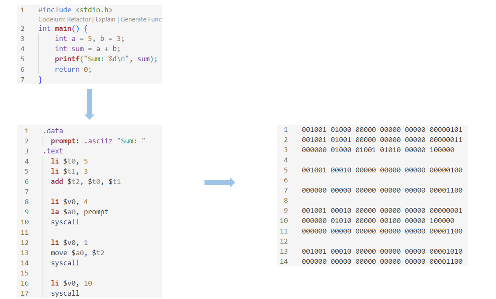

### 怎么和计算机打交道

<div style="display: flex; justify-content: space-between;">
    
    
</div>
<div style="text-align: center;">
    <strong>Figure 1:</strong> 早期将穿孔纸带输入计算机
</div>

<br>

<div style="display: flex; justify-content: space-between;">
    
    
</div>
<div style="text-align: center;">
    <strong>Figure 2:</strong> 使用汇编语言编程
</div>

<br>

<div>
    <center></center>
    <center><strong>Figure 3:</strong> 使用高级语言C语言编程</center>
</div>

### 为什么要学 C 语言

1. 基础性强：C 语言是一门底层语言，靠近计算机硬件。学习 C 语言能够帮助你理解计算机是如何工作的，如内存管理、指针操作和硬件交互等。很多高级语言（如 C++、Python）都基于 C 语言。
2. 高效性能：C 语言生成的代码通常比很多高级语言效率更高，特别适合对性能要求高的场景，比如实时系统、游戏引擎等。
3. 。。。

### 怎么开始学习 C/C++ 语言

首先需要一个写代码的好地方，推荐 VS Code

1. 安装 VS Code
2. 安装 C/C++ 扩展
3. 安装 [MinGW-w64](https://www.msys2.org/) 编译工具，并检查
4. 向编程世界打声招呼

```c++
#include <iostream>
using namespace std;

int main()
{
    cout << "Hello, World!" << endl;

    return 0;
}
```