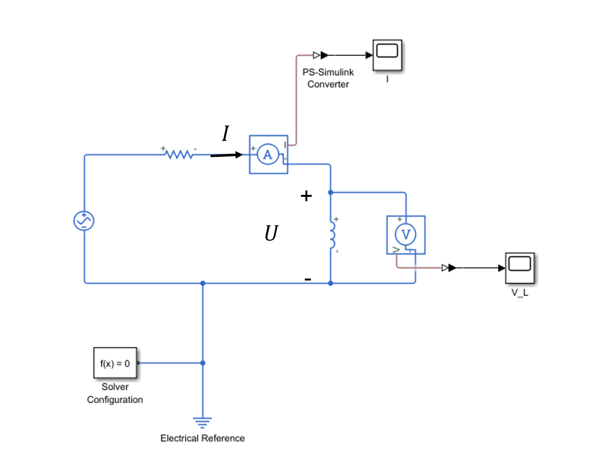
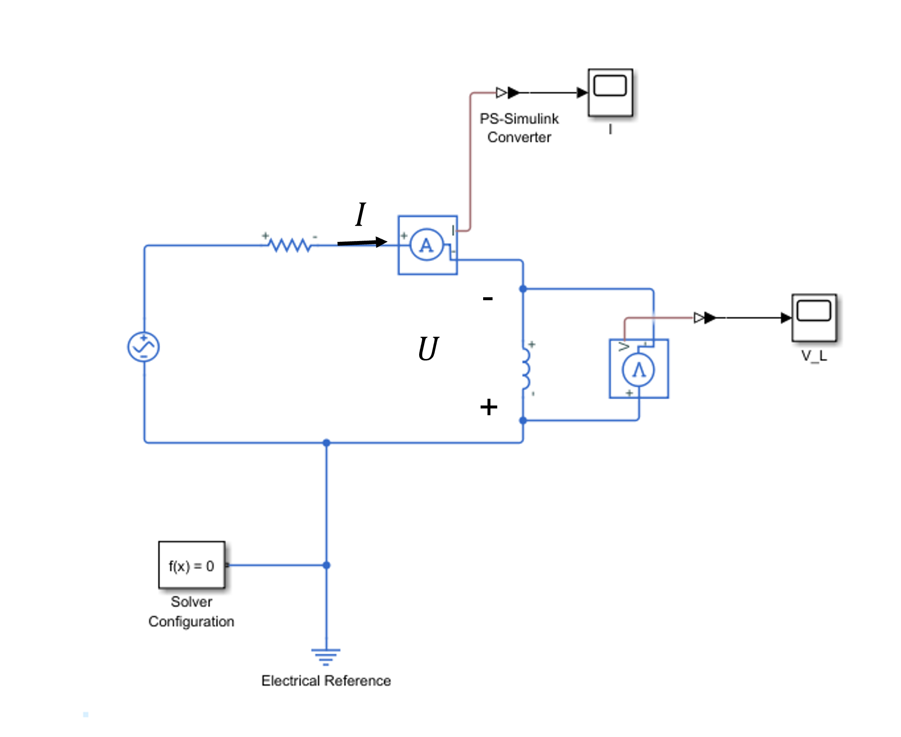

### 前言

在电路分析中，自感值的正负判断是电磁学学习的一个重要知识点。很多初学者容易混淆关联参考方向和非关联参考方向下的自感值符号问题。本文将通过理论分析和 MATLAB 仿真相结合的方式，深入浅出地讲解这个知识点。

### 核心结论

✅ 关键结论：自感值的正负取决于电压和电流的参考方向关系：

* 关联参考方向时：$ L > 0 $
* 非关联参考方向时：$ L < 0 $

### 理论分析

我们首先来看一个简单的线圈模型：

    

    
<strong>图 1:</strong> 线圈结构示意图 

 

假设通过线圈的电流为 $ I = I_m sin(\omega t) $，我们重点分析前半个周期。

**1.第一个 1/4 周期分析（$ t = 0 \to \frac{\pi}{2} $）**

在这个时间段内：

1. 电流为正且在增加（$ \frac{dI}{dt} > 0 $）

2. 根据右手定则，磁通量向上增加

3. 由楞次定律可知，感应电动势 $ e $ 会产生阻碍电流变化的磁通量，产生的磁通量方向向下

对应的感应电流 $ I_e $ 和感应电动势 $ e $ 方向如图 2(a) 所示：

为了更清楚地理解，我们把感应电动势和感应电流抽象到我们熟悉的电源模型，如图 2(b) 所示。

1. 自感电压 $ U = U_{ab} $ 是外电路测量值，满足：$ U = \phi_a - \phi_b > 0 $
2. 根据自感电压公式 $ U = -e = L \frac{dI}{dt} $
3. 此时 $ \frac{dI}{dt} > 0 $，故 $ L > 0 $

    

    
<strong>图 2:</strong> $ U $ 和 $ I $ 取关联方向在 $ t = 0 \to \frac{\pi}{2} $ 时的自感电压和感应电动势 

 

**2.第二个 1/4 周期分析（$ t = \frac{\pi}{2} \to \pi $）**

在这个时间段内：

1. 电流正向减小（$ \frac{dI}{dt} < 0 $）
2. 磁通量向上减小
3. 感应电动势 $ e $ 会产生阻碍电流减小的磁通量，产生的磁通量方向向上

感应电流和电动势方向如图 3(a) 所示：

1. 自感电压 $ U = U_{ab} $，满足：$ U = \phi_a - \phi_b < 0 $
2. 根据自感电压公式 $ U = -e = L \frac{dI}{dt} $
3. 此时 $ \frac{dI}{dt} < 0 $，仍得 $ L > 0 $

    

    
<strong>图 3:</strong> $ U $ 和 $ I $ 取关联方向在 $ t = \frac{\pi}{2} \to \pi $ 时的自感电压和感应电动势 

 

用这种方法分析 $ U $ 和 $ I $ 取非关联方向时，自感值取负号。线圈换另外一个方向得到的结论也是相同的。在此就不做展开了，有兴趣的读者可以自行尝试。

### MATLAB Simscape 仿真验证

为了直观验证理论分析，我使用 MATLAB Simscape 搭建了 RL 电路仿真模型。

**仿真电路参数**

* 交流电压源：幅值 $ 10 V $，频率 $ 50 Hz $
* 电阻 $ 10 \Omega $
* 电感 $ 1 \mu H $

**关联参考方向仿真**

仿真电路图如图 4 所示:

    

    
<strong>图 4:</strong> RL 仿真电路图 

 

关键波形测量

* 电流传感器测量回路电流 $ I $
* 电压传感器测量电感两端电压 $ U $（与电流取关联参考方向）

电流和电压的仿真波形图如图 5 所示:

    

    
<strong>图 5:</strong> RL 电路电流（左）与电感电压（右）波形 

 

相位关系分析

从仿真波形可以清晰观察到：
1. 相位差：电感电压超前电流 $ 0.005 s $
2. 理论计算：$ \frac{1}{4} T = \frac{1}{4 f} = \frac{1}{4 \times 50} = 0.005 s (90 \degree) $
3. 频域关系：$ U = -e = j \omega L I $

✅ 验证结果：只有当 $ L > 0 $ 时，电压才会超前电流 $ 90 \degree $，这与我们的理论分析完全一致。

**非关联参考方向仿真**

仿真电路图如图 6 所示，得到的波形仿真波形图如图 7 所示:

    

    
<strong>图 6:</strong> RL 仿真电路图（电压电流取非关联参考方向） 

    

    
<strong>图 7:</strong> 电压电流取非关联参考方向时，RL 电路电流（左）与电感电压（右）波形 

**相位关系分析**

从仿真波形可以清晰观察到：
1. 相位差：电感电压滞后电流 $ 0.005 s $
2. 频域关系：$ U = -e = j \omega L I $

✅ 验证结果：只有当 $ L < 0 $ 时，电压才会滞后电流 $ 90 \degree $，这与我们的理论分析完全一致。