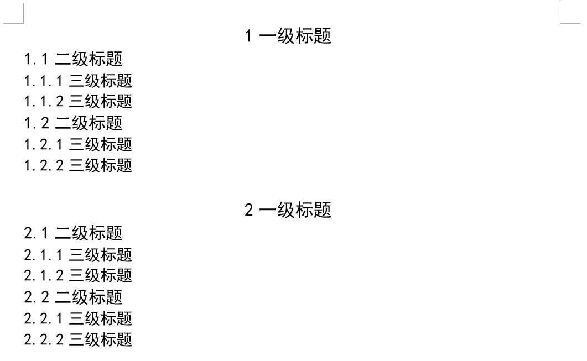
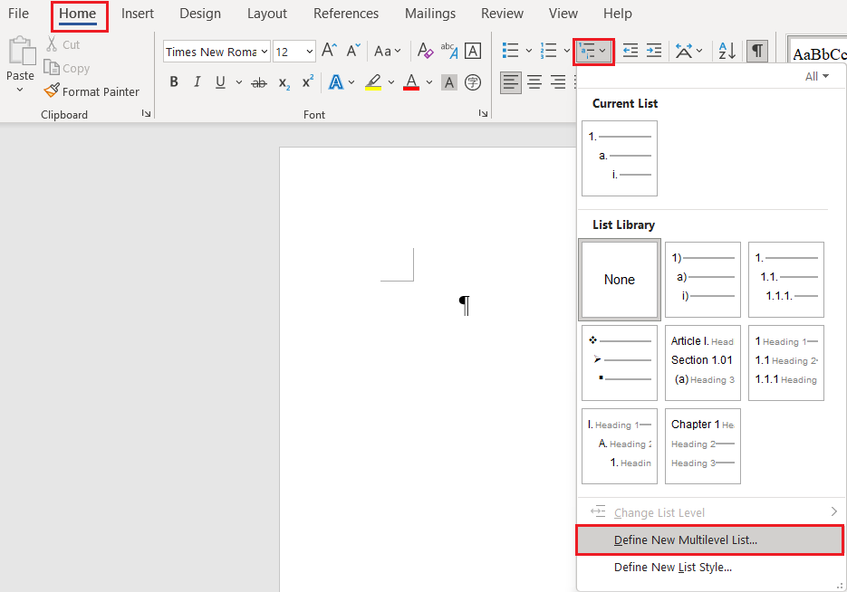
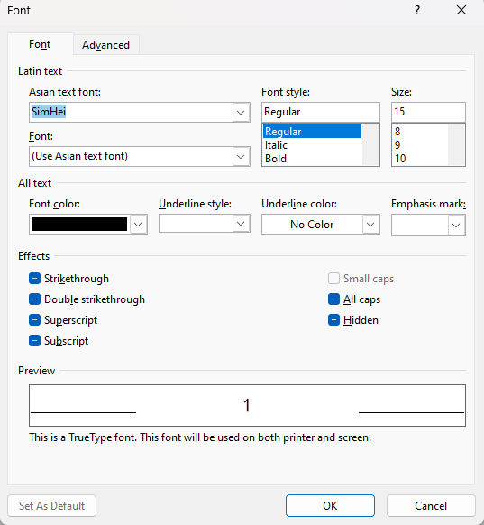
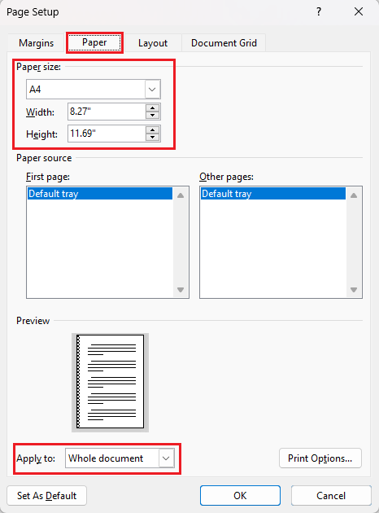
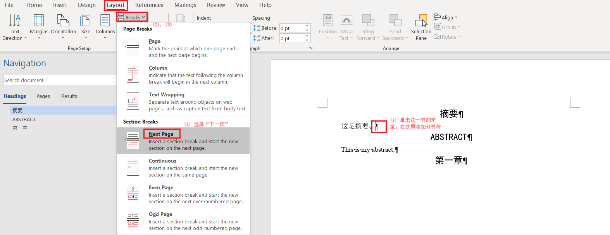
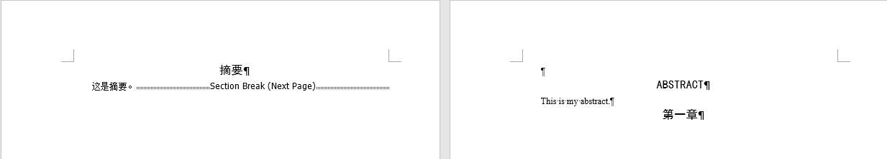

### 1. 设置 Word 多级标题模板

在 Word 2021 上建立本科毕业论文的多级标题模板，最终实现效果如下：

    

    
<strong>图 1.1:</strong> 多级标题最终效果 

 

**1.1 设置各级标题的样式**

首先在 “开始 —> 样式” 里设置每一级标题的格式。设置好样式后，选中文档内容再选择相应样式即可。

    

    
<strong>图 1.2:</strong> 创建各类标题样式的入口 

 

**1.1.1 正文**

本文正文要求：中文宋体（西文 Times New Roman）五号、不加粗、首行缩进、对齐方式为两端对齐、段前段后 0 间距、行距为固定值 20 磅。设置如下：

    
    

    <strong>图 1.3:</strong> 正文的中英文和对齐方式设置

    

    
<strong>图 1.4:</strong> 正文段落设置 

 

其中“段落”在“修改样式”左下角的“格式”中打开。

**1.1.2 一级标题**

一级标题要求：中西文为黑体（SimHei）三号，首行无缩进，对齐方式为居中、段前段后 0 行间距、行距为单倍行距。设置如下：

    
    

    <strong>图 1.5:</strong> 一级标题的中英文和段落设置

 

**1.1.3 其他样式设置**

二、三级标题以及段落列表设置步骤同理，按照要求设置即可。

 

**1.2 设置各级列表**

点击 “开始 —> 段落 —> 多级列表”，然后点击多级列表最下面的“定义新的多级列表”开始设置。

    

    
<strong>图 1.6:</strong> 创建多级列表入口 

 

**1.2.1 第1级别（对应一级标题）**

显然，图中每一个级别对应每一级别的标题。从第1级别开始设置。1级标题要求编号格式为“1 (空格) 一级标题”，设置如下：

    
    

    <strong>图 1.7:</strong> 一级列表的字体和段落设置

 

**1.2.2 第2级别（对应二级标题）**
设置步骤同理，此处需要注意的是2级标题的编号要求为“1.1 (空格) 二级标题”，即“1级编号.2级编号”，需要包含第1级别编号。设置步骤如下：

    
    

    <strong>图 1.8:</strong> 二级列表的字体和段落设置

 

“1级编号.2级编号”的设置技巧是：

设置好“此级别的编号样式”。

先到一级列表处把“要在库中显示的级别”重新设置为“级别1”，然后选择“包含的级别编号来自”为“级别1”。最后选择“此级别的编号样式”，可以看到编号按顺序显示。

在1级别编号后加上“.”，即可呈现目标格式。

**1.2.3 第3级别（对应三级标题）**

设置步骤同理，此处需要注意的是三级标题的要求为“1.1.1 (空格) 三级标题”，即“1级编号.2级编号.3级编号”，需要包含第1和第2级别编号。设置步骤如下：

    
    

    <strong>图 1.9:</strong> 三级列表的字体和段落设置

 

“1级编号.2级编号.3级编号”的设置技巧是：

设置好“此级别的编号样式”。

先把一级列表重新设置级别1，二级列表重新设置级别2。然后，先选一次级别1，再选一次级别2。

在1级别和2级别编号后加上“.”，即可呈现目标格式。

 

### 2. 页面设置

**2.1 页面边距和大小设置**

用A4（210×297mm）标准大小的白纸打印。页边距按以下标准设置：上边距为：30 mm；下边距25mm；左边距和右边距为：25mm；装订线：10mm。设置步骤如下：

    
    

    <strong>图 2.1:</strong> 全文的页边距和纸张大小设置

 

注意要应用到全文。

 

**2.2 文档分节**

在论文叙述中，我们需要对全文不同部分进行分节，以便后续设置页眉、页脚和目录等。设置步骤如下：

    

    
<strong>图 2.2:</strong> 在末尾添加分节符 

 

    

    
<strong>图 2.3:</strong> 添加分节符的效果 

 
