### 1 设置 Word 多级标题模板

本章主要参考 [【Word多级标题完整设置】各级标题样式&自动编号](https://blog.csdn.net/weixin_45313452/article/details/132515206)

在 Word 2021 上建立本科毕业论文的多级标题模板，最终实现效果如下：

    

    
<strong>图 1.1:</strong> 多级标题最终效果 

 

**1.1 设置各级标题的样式**

首先在 “开始 —> 样式” 里设置每一级标题的格式。设置好样式后，选中文档内容再选择相应样式即可。

    

    
<strong>图 1.2:</strong> 创建各类标题样式的入口 

 

**1.1.1 正文**

本文正文要求：中文宋体（西文 Times New Roman）小四号（12 pt）、不加粗、首行缩进、对齐方式为两端对齐、段前段后 0 间距、行距为固定值 20 磅。设置如下：

    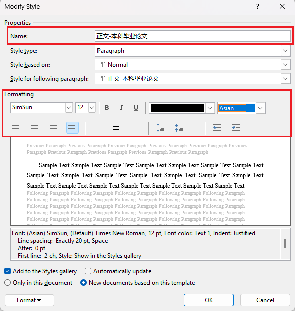
    

    <strong>图 1.3:</strong> 正文的中英文和对齐方式设置

    
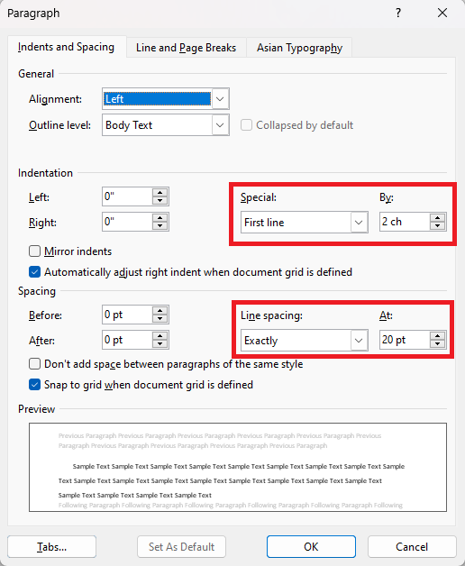

    
<strong>图 1.4:</strong> 正文段落设置 

 

其中“段落”在“修改样式”左下角的“格式”中打开。

**1.1.2 一级标题**

一级标题要求：中西文为黑体（SimHei）三号，首行无缩进，对齐方式为居中、段前段后 0 行间距、行距为单倍行距。设置如下：

    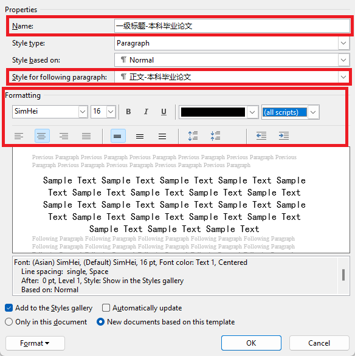
    

    <strong>图 1.5:</strong> 一级标题的中英文和段落设置

 

**1.1.3 其他样式设置**

二、三级标题以及段落列表设置步骤同理，按照要求设置即可。

 

**1.2 设置各级列表**

点击 “开始 —> 段落 —> 多级列表”，然后点击多级列表最下面的“定义新的多级列表”开始设置。

    

    
<strong>图 1.6:</strong> 创建多级列表入口 

 

**1.2.1 第1级别（对应一级标题）**

显然，图中每一个级别对应每一级别的标题。从第1级别开始设置。1级标题要求编号格式为“1 (空格) 一级标题”，设置如下：

    
    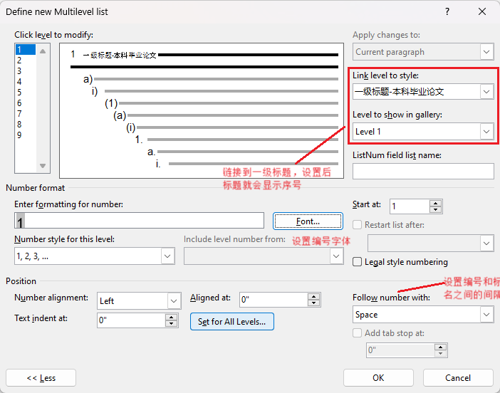

    <strong>图 1.7:</strong> 一级列表的字体和段落设置

 

**1.2.2 第2级别（对应二级标题）**
设置步骤同理，此处需要注意的是2级标题的编号要求为“1.1 (空格) 二级标题”，即“1级编号.2级编号”，需要包含第1级别编号。设置步骤如下：

    
    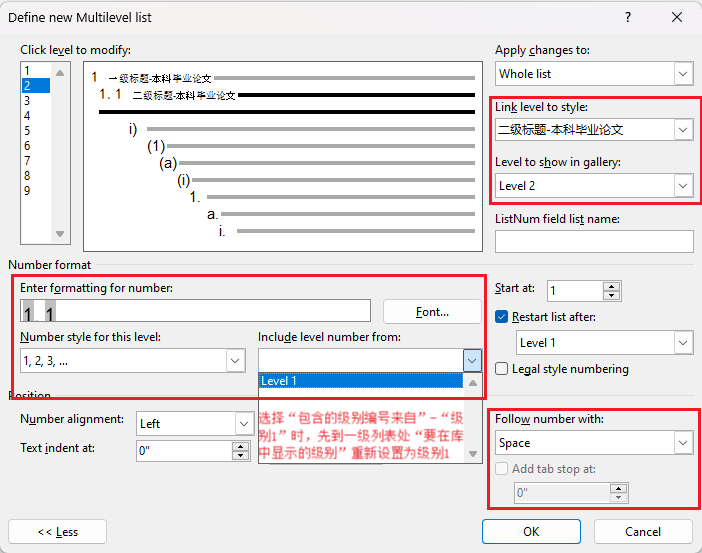

    <strong>图 1.8:</strong> 二级列表的字体和段落设置

 

“1级编号.2级编号”的设置技巧是：

设置好“此级别的编号样式”。

先到一级列表处把“要在库中显示的级别”重新设置为“级别1”，然后选择“包含的级别编号来自”为“级别1”。最后选择“此级别的编号样式”，可以看到编号按顺序显示。

在1级别编号后加上“.”，即可呈现目标格式。

**1.2.3 第3级别（对应三级标题）**

设置步骤同理，此处需要注意的是三级标题的要求为“1.1.1 (空格) 三级标题”，即“1级编号.2级编号.3级编号”，需要包含第1和第2级别编号。设置步骤如下：

    
    

    <strong>图 1.9:</strong> 三级列表的字体和段落设置

 

“1级编号.2级编号.3级编号”的设置技巧是：

设置好“此级别的编号样式”。

先把一级列表重新设置级别1，二级列表重新设置级别2。然后，先选一次级别1，再选一次级别2。

在1级别和2级别编号后加上“.”，即可呈现目标格式。

 

### 2 页面设置

**2.1 页面边距和大小设置**

用A4（210×297mm）标准大小的白纸打印。页边距按以下标准设置：上边距为：30 mm；下边距25mm；左边距和右边距为：25mm；装订线：10mm。设置步骤如下：

    
    

    <strong>图 2.1:</strong> 全文的页边距和纸张大小设置

 

注意要应用到全文。

 

**2.2 文档分节**

在论文叙述中，我们需要对全文不同部分进行分节，以便后续设置页眉、页脚和目录等。设置步骤如下：

    

    
<strong>图 2.2:</strong> 在末尾添加分节符 

 

    

    
<strong>图 2.3:</strong> 添加分节符的效果 

 

### 3 图表设置

**3.1 插入图片设置**

本节主要参考 [硕士论文中，如何针对图表插入题注、交叉引用，且后续快速插入图表目录？](https://zhuanlan.zhihu.com/p/502562519)

**3.1.1 插入图片显示不全**

由于我们设置正文格式行间距为固定值 20 磅，所以在插入图表时，会出现只显示图片一部分的情况（图 3.1 所示）。

    

    
<strong>图 3.1:</strong> 插入图片显示不全 

 

此时需要更改图片的行间距为单倍行距。设置步骤如下：

    

    
<strong>图 3.2:</strong> 调整图片间距 

 

之后，可以看到图片显示完整（图 3.3 所示）。

    

    
<strong>图 3.3:</strong> 图片显示完全 

 

**3.1.2 插入图片题注**

我们需要在图表下方加上题注，题注的格式是：“图（空格）章节号（点）图片在本章的编号”，即“图 1.1 图片名”。

首先要创建本章节图注标签，设置步骤如下：

    
    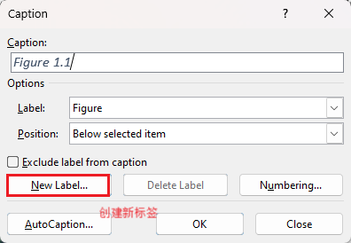

    <strong>图 3.4:</strong> 图注创建标签入口

 

    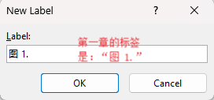
    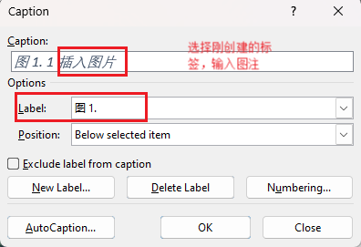

    <strong>图 3.5:</strong> 创建图注

 

插入图注之后的效果（图 3.6 所示）。

    

    
<strong>图 3.6:</strong> 初始图注效果 

 

可以看到图注的格式满足要求，但是文字样式不符合要求。

下面需要调整图注的文字样式，设置步骤如下：

    
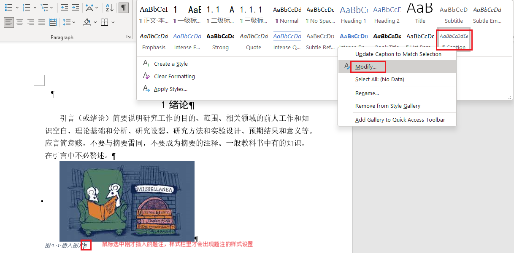

    
<strong>图 3.7:</strong> 图注样式修改入口 

 

修改图注的的中英文字体和段落设置（中文宋体（西文 Times New Roman）五号、不加粗、对齐方式为居中对齐、段前段后 0 间距、但被行距），设置步骤如下：

    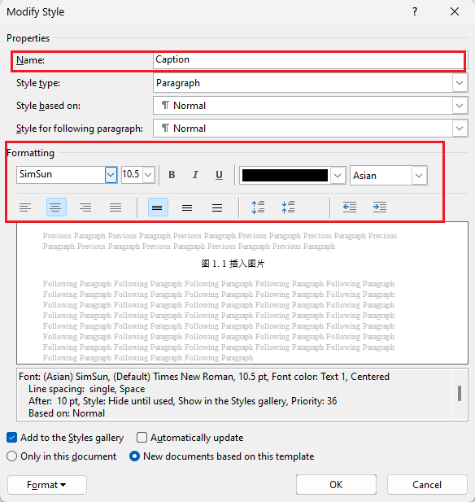
    

    <strong>图 3.8:</strong> 图注的中英文设置

 

    

    
<strong>图 3.9:</strong> 图注段落设置 

 

最后，可以看到图注的格式满足要求（图 3.10 所示）。

    

    
<strong>图 3.10:</strong> 最终图注效果 

 

**3.1.3 交叉引用图注**

一般论文中图少的时候，提到某一张图，我们可以直接打字：“如图 x.x 所示”。当图很多的时候，增加/删除图时，需要修改论文中提及的相应图号。这时候修改很容易忘记和改错。为避免这个繁琐的工作，需要做到：在增加/删除图时，其他图的图号会发生顺序变化。在文中对图片编号进行交叉引用可以解决这个问题。

交叉引用的设置步骤如下：

    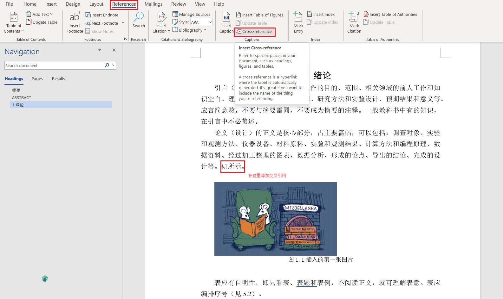
    

    <strong>图 3.11:</strong> 交叉引用的入口和设置

 

交叉引用的效果（图 3.12 所示）。图片标签和编号还是一个链接，点击可以跳转到对应的图片。

    

    
<strong>图 3.12:</strong> 最终图注效果 

 

接下来，我们展示在这张图片前面增加图片时，怎么自动更新文中的编号。

我们在前面增加一张图片，如图 3.13，可以看到插入图片的题注默认是 1.1。

    
    

    <strong>图 3.13:</strong> 给第二张图片加题注

 

加完题注之后，原本第一张图片的题注自动更改为“图 1.2”了（图 3.14 所示）。

    

    
<strong>图 3.14:</strong> 给第二张图片加题注之后的效果 

 

但此时，论文中的引用还没有改过来，我们不需要手动更改，只需要更新一下交叉引用就可以了。具体操作步骤如下：

    
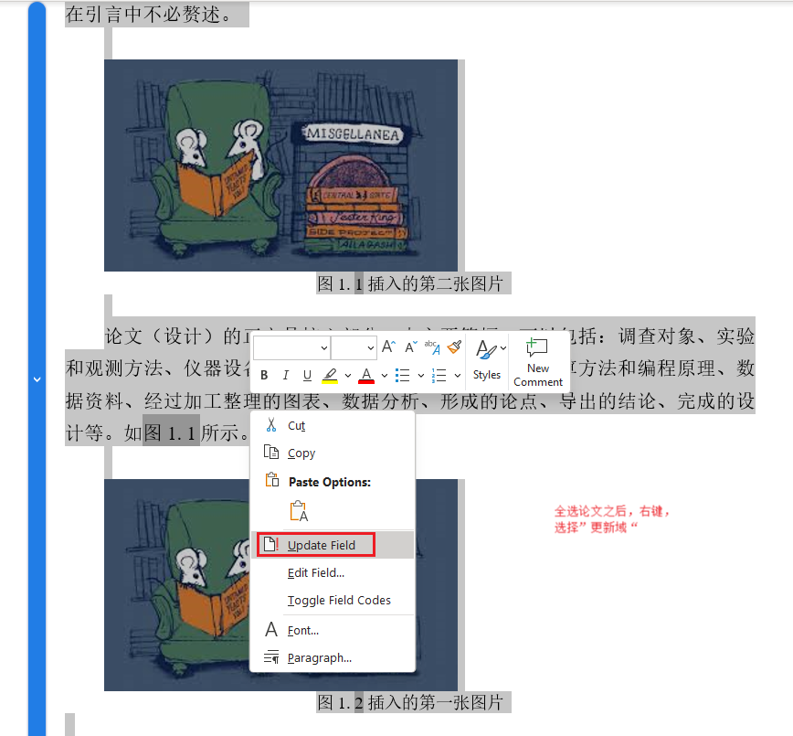

    
<strong>图 3.15:</strong> 更新交叉引用 

 

可以看到交叉引用已经更新了（图 3.16 所示）。

    

    
<strong>图 3.16:</strong> 更新交叉引用的效果 

 

当我们删除插入的第二张图片后，发现第一张图片的题注和交叉引用的都没有更新（图 3.17 所示）。这时我们同样，更新交叉引用即可（图 3.17 所示）。

    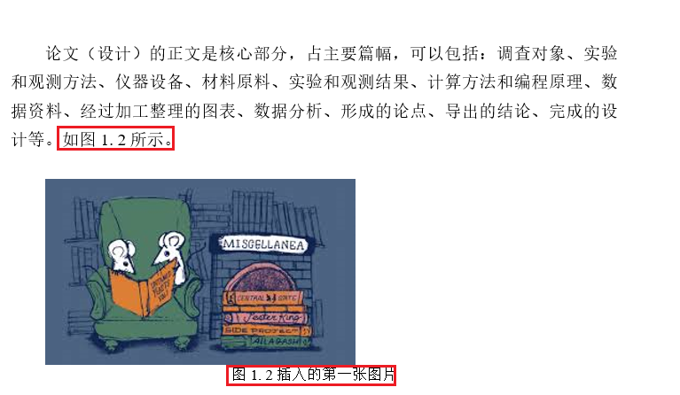
    

    <strong>图 3.17:</strong> 删除第二张图片的效果和再更新交叉引用的效果

 

这样我们就实现了自动更新题注和引用。

**3.2 插入列表设置**

插入列表和插入图片的步骤都是类似的，而且表注和图注使用同一个题注样式，也不需要设置题注样式了。

    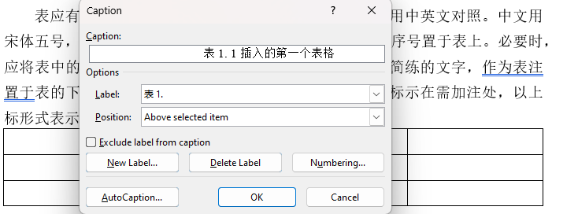
    

    <strong>图 3.18:</strong> 表注创建和效果

 

### 4 页眉页脚设置

**4.1 页眉设置**

**4.1.1 页眉边距设置**

本文要求：页眉边距 16mm，页脚边距 15mm。设置步骤如下：

    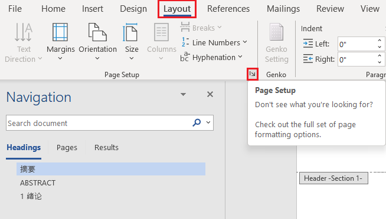
    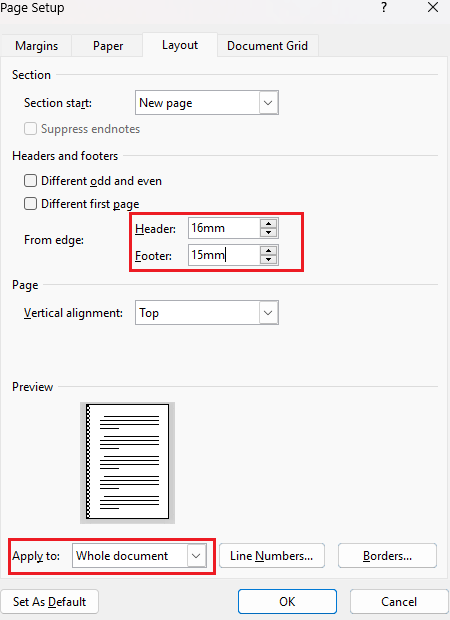

    <strong>图 4.1:</strong> 页眉页脚边距设置

 

**4.1.2 单面印制页眉设置**

本文要求：页眉左边为“重庆大学本科学生毕业论文（设计）”，右边为各章章名，打印字号为宋体小五号，页眉之下有一条下划线。设置步骤如下：

    
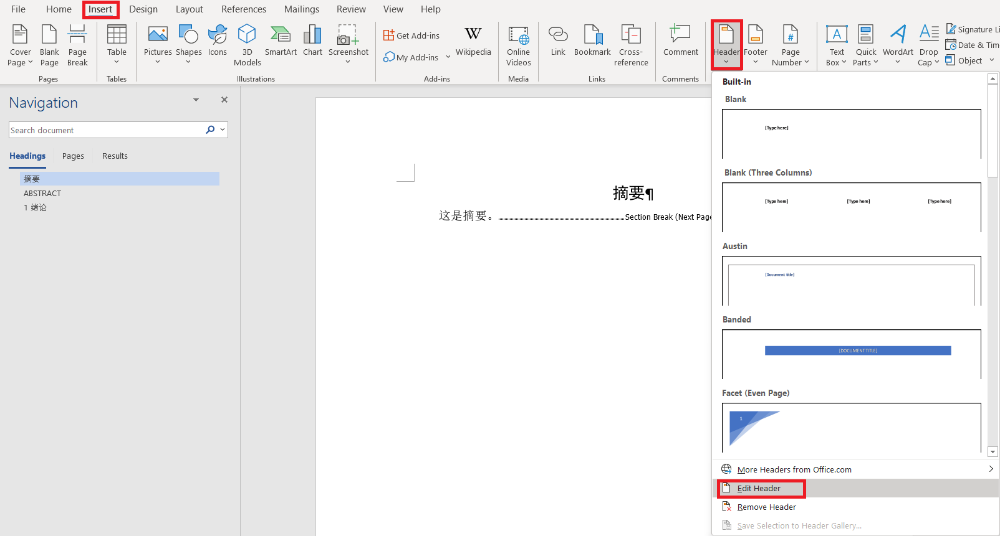

    
<strong>图 4.2:</strong> 插入页眉入口 

 

    

    
<strong>图 4.3:</strong> 按照单面印制格式输入内容 

 

    
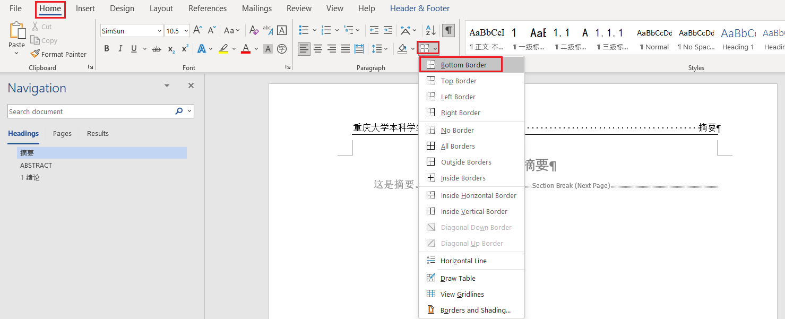

    
<strong>图 4.4:</strong> 页眉下划线设置 

 

最终单面打印页眉效果如下：

    

    
<strong>图 4.5:</strong> 单面印制页眉效果 

 

设置好第一节的页眉之后，第二节的页眉已经出现了，但是第一节的页眉相同（图 4.6），这是因为默认选择了“链接到上一节的页眉”。我们需要重新设置第二节的页眉，设置步骤如下：

    

    
<strong>图 4.6:</strong> 第一节的页眉设置之后第二节的页眉效果 

 

在修改第二节页眉之前，取消“链接到上一节的页眉”，这样才不会把刚才设置好的第一节页眉破坏，设置步骤如下：

    

    
<strong>图 4.7:</strong> 第二节取消链接到前一节 

 

这时修改第二节页眉的内容

    
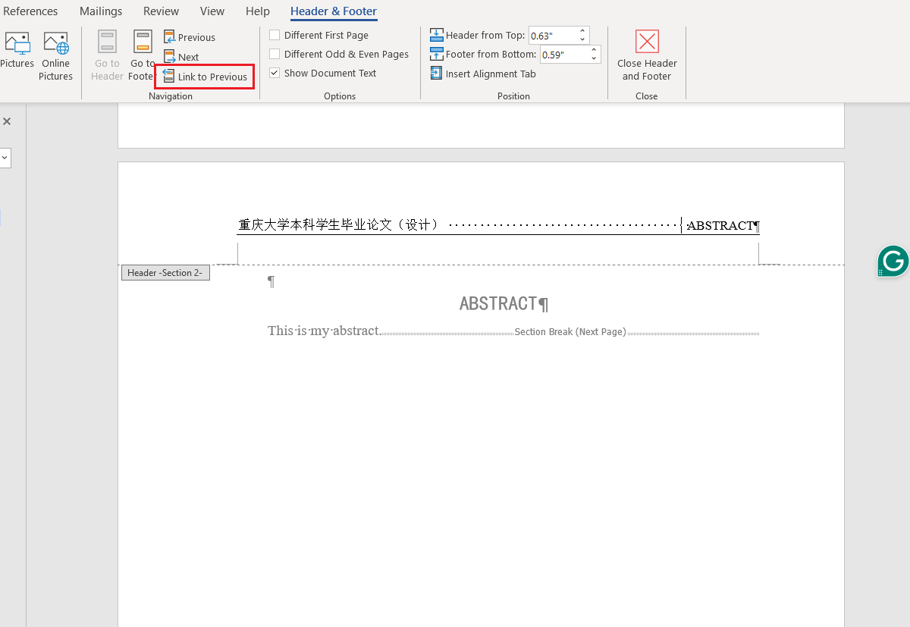

    
<strong>图 4.8:</strong> 设置第二节的页眉 

 

接下来设置其他节的页眉，同样需要取消“链接到上一节的页眉”。

**4.1.3 双面印制页眉设置**

本文要求：双面印制的，左页居中为“重庆大学本科学生毕业论文（设计）”，右页居中为各章章名。打印字号为宋体小五号，页眉之下有一条下划线。

图 4.9 所示的文档是单面页眉格式，可以看到编辑页眉时，显示的是：“第四节的页眉”。

    

    
<strong>图 4.9:</strong> 需要改成双面印制页眉 

 

接下来，将文档改成双面印制页眉格式，我们需要设置奇数页和偶数页的页眉不同，设置步骤如下：

    

    
<strong>图 4.10:</strong> 设置奇偶页页眉不同 

 

此时，我们就可以设置双面印制页眉了，如图 4.11 所示，可以看到编辑页眉时，显示的是：“第四节奇数页的页眉”和“第四节偶数页的页眉”。

    

    
<strong>图 4.11:</strong> 奇偶页页眉设置显示 

 

奇数页页眉居中为“重庆大学本科学生毕业论文（设计）”，偶数页页眉设置之前要把默认的“链接到上一节的页眉”取消，居中为各章章名，打印字号为宋体小五号，页眉之下有一条下划线，如图 4.12 所示。

    

    
<strong>图 4.12:</strong> 奇偶页页眉设置效果 

 

其他节的页眉也是按照上述方法设置。

**4.2 页脚设置**

**4.2.1 页脚边距设置**

页脚边距已经在设置页眉边距的时候设置过，无需重复设置。

**4.2.2 页码设置**

本文要求：页码位于每页页脚的中部。前置部分从论文（设计）中文摘要页起，用罗马字母单独编页，如Ⅰ、Ⅱ、Ⅲ、Ⅳ、Ⅴ……。其他部分从论文（设计）的引言（或绪论）开始，用阿拉伯数字连续编页。

首先插入页码

    

    
<strong>图 4.13:</strong> 插入页码 

 

这时我们发现只有奇数页有页码（图 4.14），因此需要在偶数页插入页码

    

    
<strong>图 4.14:</strong> 只有奇数页有页码 

 

    

    
<strong>图 4.15:</strong> 偶数页插入页码 

 

接下来修改一下，页码的字体为 Times New Roman，小五号。偶数页也要设置

    

    
<strong>图 4.16:</strong> 修改页码字体 

 

现在，我们需要把正文前的页码修改为罗马字母编号

    
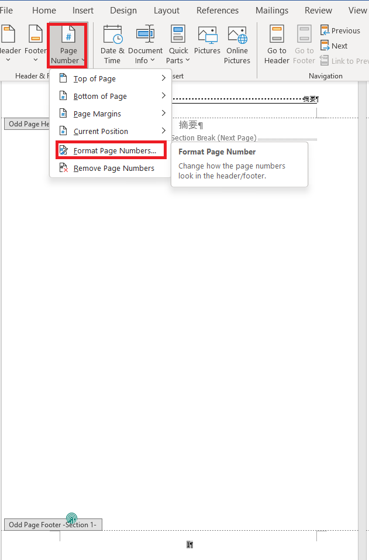

    
<strong>图 4.17:</strong> 正文前设置为罗马字母编页入口 

 

    

    
<strong>图 4.18:</strong> 正文前设置为罗马字母编页 

 

正文前的其他页，也要设置为罗马字母编页

    

    
<strong>图 4.19:</strong> 正文前其他页设置为罗马字母编页 

 

还要把正文开始部分的页码设置为阿拉伯数字连续编页

    

    
<strong>图 4.20:</strong> 正文设置为阿拉伯数字编页 

 

最后，把正文的偶数页设置为阿拉伯数字编页，因为默认”链接到上一节的页眉”，所以正文部分设置两次（奇数页和偶数页），所有的页码就设置好了。

### 5 参考文献设置

本章主要参考 [Word插入参考文献时自动编号](https://blog.csdn.net/qq_42679415/article/details/124225045)

**5.1 参考文献自动编号**

首先设置参考文献列表，样式为：[x]，字体为 Times New Roman，五号。

    
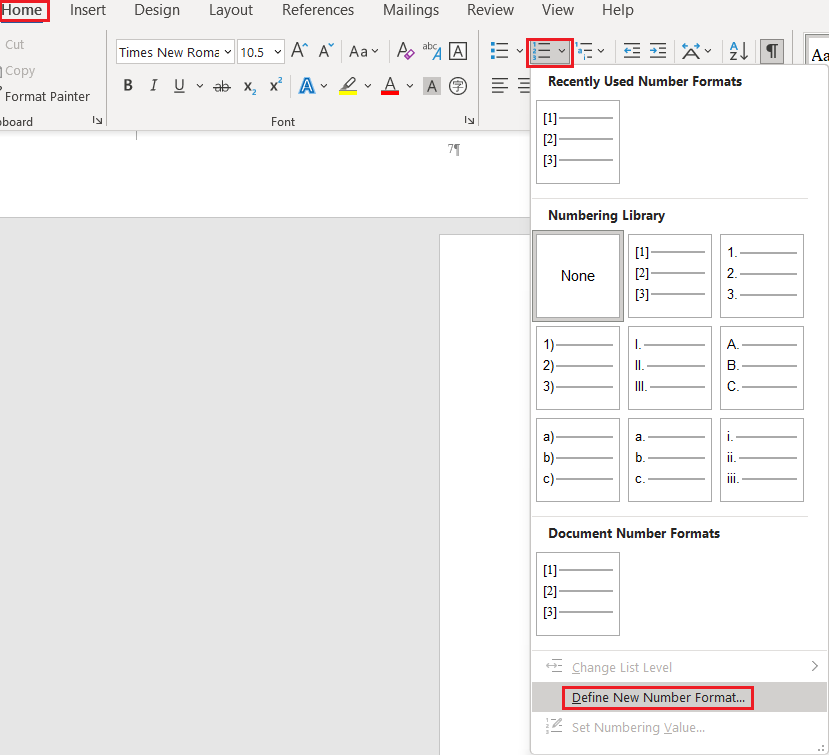

    
<strong>图 5.1:</strong> 定义编号列表入口 

 

    

    
<strong>图 5.2:</strong> 设置编号列表样式 

 

    

    
<strong>图 5.3:</strong> 设置编号列表字体 

 

此时对第一条参考文献设置编号，效果如图 5.4 所示

    

    
<strong>图 5.4:</strong> 对第一条参考文献设置编号 

 

此时编号列表的间隔不符合我们的要求，需要修改

    

    
<strong>图 5.5:</strong> 设置参考文献编号列表的间隔入口 

 

    

    
<strong>图 5.6:</strong> 设置参考文献编号列表的间隔 

 

这时的效果就符合我们的要求了（图 5.7），我们继续添加参考文献，此时已经自动编号

    

    
<strong>图 5.7:</strong> 设置间隔后的效果 

 

**5.2 参考文献交叉引用**

我们在想引用参考文献的地方，右键即可插入交叉引用

    

    
<strong>图 5.8:</strong> 插入交叉引用入口 

 

    
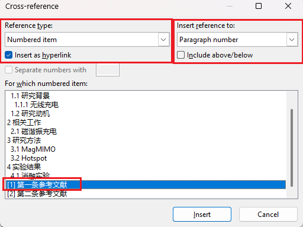

    
<strong>图 5.9:</strong> 选择引用的参考文献 

 

此时插入的引用效果如图 5.10 所示，还需要把引用设置为上标

    

    
<strong>图 5.10:</strong> 设置交叉引用为上标 

 

最终效果如图 5.11 所示，点击上标即可跳转到对应的参考文献

    

    
<strong>图 5.11:</strong> 交叉引用效果 

 

当我们把第一条参考文献移动到后面（图 5.12）时，我们需要更新把论文中的交叉引用（图 5.13）

    

    
<strong>图 5.12:</strong> 更改文献顺序 

 

    

    
<strong>图 5.13:</strong> 更新交叉引用 

 

最终成功更新为正确的引用编号（图 5.14）

    

    
<strong>图 5.13:</strong> 更新交叉引用的效果 

 

### 6 目录生成

本章主要参考 [【举例说明】Word中如何自动生成目录以及设置格式](https://blog.csdn.net/weixin_50637207/article/details/130303253)

全文写完之后需要生成目录，本文要求：目录中一级标题黑体四号，首行无缩进；二级标题黑体五号，首行缩进2字符；三级标题宋体五号，首行缩进4字符。

我们插入自定义的目录样式，如图 6.1 所示，开始生成自定义目录

    

    
<strong>图 6.1:</strong> 插入目录入口 

 

进入之后的页面如图 6.2 所示。

    

    
<strong>图 6.2:</strong> 修改显示样式入口 

 

如图 6.3 所示，“选项”是用来查看标题的目录级别，也可以自定义目录级别。这里我们就按照默认的目录级别。

    

    
<strong>图 6.3:</strong> 标题的目录级别 

 

点击“修改”按钮，我们设置不同级别目录的字体和段落样式。首先修改一级目录的字体和段落样式

    

    
<strong>图 6.4:</strong> 修改一级标题显示样式入口 

 

    
    

    <strong>图 6.5:</strong> 一级目录中英文字体设置

 

    

    
<strong>图 6.6:</strong> 一级目录段落设置 

 

然后修改第二级目录的字体和段落样式，这里只给出段落设置的步骤

    

    
<strong>图 6.7:</strong> 二级目录段落设置 

 

第三级目录的字体和段落样式设置，在此不再叙述。

最终回到最初的“目录”页面，点击“确认”，即可生成目录，目录的效果如图 6.8 所示。

    

    
<strong>图 6.8:</strong> 生成的目录 

 