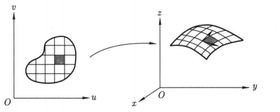
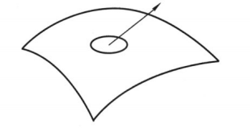
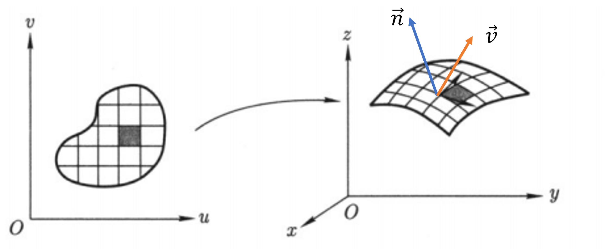

本文主要参考 [数学分析讲义（第二册）【程艺、陈卿、李平】高等教育出版社](https://easylink.cc/qse5bk)

### 0 参数曲线和参数曲面

参数曲线的表示如下

$$
\vec{r} = \vec{r} (t) = x(t) \vec{i} + y(t) \vec{j} + z(t) \vec{k}, \quad t \in [\alpha, \beta],
$$

    

    
<strong>图 0.1:</strong> 参数曲线的映射 

 

用一维变量 $ t $ 上的一条线段映射到三维空间的曲线。

参数曲面的表示如下

$$
\vec{r} = \vec{r} (u, v) = x(u, v) \vec{i} + y(u, v) \vec{j} + z(u, v) \vec{k}, \quad u, v \in D.
$$

    

    
<strong>图 0.2:</strong> 参数曲面的映射 

 

因为空间曲面可以看成由一条条空间曲线组成，因此想得到横纵很多条空间曲线，就需要二维变量 $ u, v $ 上横纵很多条线段构成的二维平面。

### 1 数量场在曲线上的积分

**1.1 参数曲线的弧长公式**

设曲线 $ L $ 的参数方程表示为

$$
\vec{r} = \vec{r}(t) = x(t) \vec{i} + y(t) \vec{j} + z(t) \vec{k}, \quad t \in [\alpha, \beta],
$$

其中 $ x(t), y(t), z(t) $ 在区间 $ [\alpha, \beta] $ 有连续的一阶微商 $ x'(t), y'(t), z'(t) $，且 $ |\vec{r'} (t)| \neq 0 $，$ \varphi(x, y, z) $ 在曲线 $ L $ 上连续，因此 $ \varphi(x(t), y(t), z(t)) $ 在 $ [\alpha, \beta] $ 上连续。

当分割的弧长很小的时候，以**两点之间的折线长代替弧长**。

现在作 $ [\alpha, \beta] $ 的分割

$$
T: \alpha = t_0 < t_1 < t_2 < \cdots < t_{n - 1} < t_n = \beta.
$$

由此对应曲线 $ L $ 上以 $ M_i(x(t_i), y(t_i), z(t_i)), i = 0, 1, 2, \dots, n $，为分割点的分割。

    

    
<strong>图 1.1:</strong> 参数曲线的弧长 

 

如图 1.1 所示，曲线的弧长可以表示为

$$
l(T) = \sum_{i = 1}^{n} |\vec{r} (t_i) - \vec{r} (t_{i - 1})| = \sum_{i = 1}^{n} \sqrt{(x(t_i) - x(t_{i - 1}))^2 + (y(t_i) - y(t_{i - 1}))^2 + (z(t_i) - z(t_{i - 1}))^2}
$$

由微分中值定理可得，$ \exist \xi_i, \eta_i, \zeta_i $，使得 $ x(t_i) - x(t_{i - 1}) = x'(\xi_i) \Delta t_i, y(t_i) - y(t_{i - 1}) = y'(\eta_i) \Delta t_i, z(t_i) - z(t_{i - 1}) = z'(\zeta_i) \Delta t_i $，得到

$$
l(T) = \sum_{i = 1}^{n} \sqrt{x'(\xi_i)^2 + y'(\eta_i)^2 + z'(\zeta_i)^2} \Delta t_i,
$$

其中 $ t_{i - 1} < \xi_i, \eta_i, \zeta_i < t_i, \Delta t_i = t_i - t_{i - 1} $。注意此时，$ x(t), y(t), z(t) $ 这三个函数不一定在同一点取导数，即不一定满足 $ \xi_i = \eta_i = \zeta_i $。因此上式并不是严格的 Riemann（黎曼）和的形式，需要做必要的修正，使其近似一个 Riemann 和的形式。

可以证明

$$
\forall \varepsilon > 0, 
|\sqrt{x'(\xi_i)^2 + y'(\eta_i)^2 + z'(\zeta_i)^2} - |\sqrt{x'(t_i)^2 + y'(t_i)^2 + z'(t_i)^2}| < \varepsilon
$$

因此

$$
|l(T) - \sum_{i = 1}^{n} |\vec{r'} (t_i)| \Delta t_i| < \varepsilon \sum_{i = 1}^{n} \Delta t_i = \varepsilon (\beta - \alpha)
$$

而 $ |\vec{r'} (t_i)| $ 在 $ [\alpha, \beta] $ 上的 Riemann 和的极限 $ \sum_{i = 1}^{n} |\vec{r'} (t_i)| \Delta t_i| $正是 $ |\vec{r'} (t_i)| $ 在 $ [\alpha, \beta] $ 上的积分 $ \int_{\alpha}^{\beta} |\vec{r'} (t)| dt $。

因此 $ L $ 的弧长 $ l $ 定义为

$$
l = \lim_{||T|| \to 0} l(T) = \int_{\alpha}^{\beta} |\vec{r'} (t)| dt = \int_{\alpha}^{\beta} \sqrt{x'(t)^2 + y'(t)^2 + z'(t)^2} dt
$$

**1.2 基本定义**

设 $ L $ 时三维空间中一条光滑（或逐段光滑）曲线段，$ \varphi(x, y, z) $ 时定义在曲线 $ L $ 上的数量场（或函数）。作 $ L $ 的任意分割：$ M_0, M_1, M_2, \dots, M_n $，并记每段 $ \overgroup{M_{i - 1} M_i} $ 的弧长为 $ \Delta s_i $，最大长度为 $ \lambda = \max {|\Delta s_i|, i = 1, 2, \dots, n} $。在每段弧 $ \overgroup{M_{i - 1} M_i} $ 上任取一点 $ N_i(\xi_i, \eta_i, \zeta_i) $。如果下列和式的极限

$$
\lim_{\lambda \to 0} \sum_{i = 1}^n \varphi(\xi_i, \eta_i, \zeta_i) \Delta s_i
$$

是一个有限数，且与点 $ N_i(\xi_i, \eta_i, \zeta_i) $ 的选择无关，那么称函数 $ \varphi(x, y, z) $ 在曲线 $ L $ 上可积。极限值称为数量场在曲线上的积分，或称为第一型曲线积分，记为

$$
\int_{L} \varphi(x, y, z) ds
$$

**1.3 数量场在曲线上的积分的计算**

设曲线 $ L $ 的参数方程表示为

$$
\vec{r} = \vec{r}(t) = x(t) \vec{i} + y(t) \vec{j} + z(t) \vec{k}, \quad t \in [\alpha, \beta],
$$

其中 $ x(t), y(t), z(t) $ 在区间 $ [\alpha, \beta] $ 有连续的一阶微商 $ x'(t), y'(t), z'(t) $，且 $ |\vec{r'} (t)| \neq 0 $，$ \varphi(x, y, z) $ 在曲线 $ L $ 上连续，因此 $ \varphi(x(t), y(t), z(t)) $ 在 $ [\alpha, \beta] $ 上连续。

现在作 $ [\alpha, \beta] $ 的分割

$$
T: \alpha = t_0 < t_1 < t_2 < \cdots < t_{n - 1} < t_n = \beta.
$$

由此对应曲线 $ L $ 上以 $ M_i(x(t_i), y(t_i), z(t_i)), i = 0, 1, 2, \dots, n $，为分割点的分割。由弧长的计算公式与积分中值定理，得到弧段 $ \overgroup{M_{i - 1} M_i} $ 的长为

$$
\Delta s_i = \int_{t_{i - 1}}^{t_i} |\vec{r'} (t)| dt = |\vec{r'} (\theta_i)| \Delta t_i,
$$

其中 $ t_{i - 1} \leq \theta_i \leq t_i, \Delta t_i = t_i - t_{i - 1} (i = 1, 2, \dots, n) $。

取弧段上任意一点 $ N_i(\tau_i, \tau_i, \tau_i), t_{i - 1} \leq \tau_i \leq t_i (i = 1, 2, \dots, n) $，于是

$$
\sum_{i = 1}^n \varphi(x(\tau_i), y(\tau_i), z(\tau_i)) \Delta s_i = \sum_{i = 1}^n \varphi(x(\tau_i), y(\tau_i), z(\tau_i)) |\vec{r'} (\theta_i)| \Delta t_i
$$

等式的右边还不是一个函数的 Riemann 和，但我们可以作修正，$ \sum_{i = 1}^n \varphi(x(\tau_i), y(\tau_i), z(\tau_i)) |\vec{r'} (\theta_i)| \Delta t_i $ 近似于 $ \sum_{i = 1}^n \varphi(x(\tau_i), y(\tau_i), z(\tau_i)) |\vec{r'} (\tau_i)| \Delta t_i $

此 Riemann 和的极限正是 $ \varphi(x(t), y(t), z(t)) $ 在 $ [\alpha, \beta] $ 上的积分，因此

$$
\int_L \varphi(x, y, z) ds = \int_{\alpha}^{\beta} \varphi(x(t), y(t), z(t)) |\vec{r'} (t)| dt = \int_{\alpha}^{\beta} \varphi(x(t), y(t), z(t)) \sqrt{x'(t)^2 + y'(t)^2 + z'(t)^2} \Delta t
$$

$ ds = |\vec{r'} (t)| \Delta t $。

### 2 向量场在曲线上的积分

**2.1 物理背景**

设 $ F(x,y,z) = P(x,y,z) \vec{i} + Q(x,y,z) \vec{j} + R(x,y,z) \vec{k} $ 是一个力场,考察一个质点沿一条曲线 $ L $运动时力场所做的功，应注意三个要素，即力场的方向、质点运动的方向和质点运动的距离。为此可以采取以下办法(图 2.1)：

    

    
<strong>图 2.1:</strong> 参数曲线上做功 

 

沿质点运动方向上作曲线 $ L $ 的一个分割，记为 $ M_i(x_i, y_i, z_i), i = 0, 1, 2, \dots, n $。

在第 $ i $ 段上，力场 $ \vec{F} $ 可近似成一个常值向量

$$
\vec{F_i} = P_i \vec{i} + Q_i \vec{j} + R_i \vec{k}.
$$

该段曲线可近似成有向线段

$$
\Delta \vec{r}_i = \vec{M_{i - 1} M_i} = \Delta x_i \vec{i} + \Delta y_i \vec{j} + \Delta z_i \vec{k}.
$$

它的方向指向质点运动的方向。因此力场在每一小段上所做的功可近似为

$$
W_i = \vec{F_i} \cdot \Delta \vec{r}_i = P_i \Delta x_i + Q_i \Delta y_i + R_i \Delta z_i.
$$

将这样的近似值相加,并让分割的最大长度趋于零,那么结果就是力场所做的总功。

**2.2 数量场在曲线上的积分的定义**

设 $ \vec{v} = P(x, y, z) \vec{i} + Q(x, y, z) \vec{j} + R(x, y, z) \vec{k} $ 是空间区域 $ D $ 中的向量场，$ L_{AB} $ 是 $ D $ 中的定向曲线，在 $ L_{AB} $ 上从 $ A $ 到 $ B $ 依次选取任意的分割点：

$$
A = M_0, M_1, M_2, \dots, M_n = B,
$$

其中分割点的坐标是 $ M_i(X_i, Y_i, Z_i), i = 0, 1, 2, \dots, n $。则

$$
\Delta \vec{r}_i = \vec{M_{i - 1} M_i} = \Delta x_i \vec{i} + \Delta y_i \vec{j} + \Delta z_i \vec{k}.
$$

在每一段弧 $ \overgroup{M_{i - 1}{M_i}} $ 上任取一点 $ N_i(\xi_i, \eta_i, \zeta_i) $，当分割的最大长度趋于零时，如果下列和式：

$$
\sum_{i = 1}^n \vec{v}(\xi_i, \eta_i, \zeta_i) \Delta \vec{r}_i = \sum_{i = 1}^n P(\xi_i, \eta_i, \zeta_i) \Delta x_i + Q(\xi_i, \eta_i, \zeta_i) \Delta y_i + R(\xi_i, \eta_i, \zeta_i)  \Delta z_i
$$

的极限存在且有限，那么极限值称为向量场 $ \vec{v} $ 沿着曲线 $ L_{AB} $ 上的积分，记为

$$
\int_{L_{AB}} \vec{v} \cdot d\vec{r}.
$$

**2.3 数量场在曲线上的积分的计算**

下面利用曲线的参数方程表示，将向量场在曲线上的积分的计算具体化。

设向量场 $ \vec{v} = P(x, y, z) \vec{i} + Q(x, y, z) \vec{j} + R(x, y, z) \vec{k} $ 在区域 $ D $ 内
连续，曲线 $L_{AB} \subset D $具有参数方程表示

$$
L_{AB}: \vec{r}=\vec{r} (t) = x(t) \vec{i} + y(t) \vec{j} + z(t) \vec{k}, t \in [\alpha, \beta],
$$

且有连续的导函数，参数$ t $ 是正向参数，则向量场在 $ L_{AB} $ 上可积，且可化为下列定积分

$$
\int_{L_{AB}} \vec{v} \cdot d\vec{r} = \int_{\alpha}^{\beta} \vec{v}(\vec{r}(t)) \cdot \vec{r'}(t) dt = \int_{\alpha}^{\beta} [P(x(t), y(t), z(t)) x'(t) + Q(x(t), y(t), z(t)) y'(t) + R(x(t), y(t), z(t)) z'(t)] dt
$$

下面进行证明

对参数所在的区间 $ [\alpha, \beta] $ 进行的任意分割 $ T: \alpha = t_0 < t_1 < t_2 < \cdots < t_n = \beta $，则对应曲线上沿方向从 $ A $ 到 $ B $ 的任意分割 $ A = M_0, M_1, M_2, \cdots, M_n = B $，根据曲线参数方程表示的连续性可知，关于$ t $ 的分割最大长度趋于零等价于曲线上
对应的分割最大长度趋于零。此时

$$
\Delta \vec{r}_i = \vec{M_{i - 1} M_i} = \vec{r}(t_i) - \vec{r}(t_{i - 1}) = \Delta x_i \vec{i} + \Delta y_i \vec{j} + \Delta z_i \vec{k}.
$$

根据微分中值定理有

$$
\Delta x_i = x(t_i) - x(t_{i - 1}) = x'(\lambda_i) \Delta t_i, \Delta y_i = y(t_i) - y(t_{i - 1}) = y'(\mu_i) \Delta t_i, \Delta z_i = z(t_i) - z(t_{i - 1}) = z'(\nu_i) \Delta t_i,
$$

其中 $ t_{i - 1} \leq \lambda_i, \mu_i, \nu_i \leq t_i $。取第 $ i $ 段曲线上任意一点

$$
(\xi_i, \eta_i, \zeta_i) = (x(\tau_i), y(\tau_i), z(\tau_i)), \tau_i \in [t_{i - 1}, t_i],
$$

这里 $ i = 1, 2, \dots, n $，则

$$
\begin{aligned}
\sum_{i = 1}^{n} \vec{v}(\xi_i, \eta_i, \zeta_i) \cdot \Delta \vec{r}_i &= \sum_{i = 1}^n \vec{v}(x(\tau_i), y(\tau_i), z(\tau_i)) \cdot \Delta \vec{r}_i \\
&= \sum_{i = 1}^n (P(x(\tau_i), y(\tau_i), z(\tau_i)) x'(\lambda_i) + Q(x(\tau_i), y(\tau_i), z(\tau_i)) y'(\mu_i) + R(x(\tau_i), y(\tau_i), z(\tau_i)) z'(\nu_i)) \Delta t_i
\end{aligned}
$$

注意到上式最后一个等式中，虽然三个求和项都不是严格的 Riemann 和，但可以采取数量场在曲线上积分时的处理办法,进行必要的修正，使得每个求和都能表示成严格的 Riemann 和（即$ \lambda_i = \mu_i = \nu_i = \tau_i $）与一个修正项之和。当$ |T| \to 0 $时，修正项的极限为零，所以有

$$
\begin{aligned}
\lim_{|T| \to 0} \sum_{i = 1}^n \vec{v}(x(\tau_i), y(\tau_i), z(\tau_i)) \cdot \Delta \vec{r}_i &= \int_{\alpha}^{\beta} [P x'(t) + Q y'(t) + R z'(t)] dt \\
&= \int_{\alpha}^{\beta} \vec{v}(\vec{r}(t)) \cdot \vec{r'}(t) dt
\end{aligned}
$$

向量场在曲线上的积分有下列两种表示，每一种表示都突出了积分的某种
含义。

首先，设 $ s $ 为曲线 $ L_{AB} $ 的弧长参数，弧长的增长对应曲线正向，$ \vec{\tau}(s) = \frac{\vec{r'}(s)}{|\vec{r'}(s)|} $ 为弧长方向上的单位向量，有

$$
d \vec{r} = \vec{r'}(s) dt = \frac{\vec{r'}(s)}{|\vec{r'}(s)|} |\vec{r'}(s)| dt = \vec{\tau}(s) ds.
$$

因此，向量场的曲线积分可表示为

$$
\int_{L_{AB}} \vec{v} \cdot d \vec{r} = \int_{L_{AB}} \vec{v} \cdot d \vec{r} = \int_{L_{AB}} \vec{v} \cdot \vec{\tau} ds.
$$

等式的右边正是一个关于数量场 $ \vec{v} \cdot \vec{\tau} $ 的曲线积分。

其次，利用

$$
d \vec{r} = dx \vec{i} + dy \vec{j} + dz \vec{k},
$$

我们有

$$
\int_{L_{AB}} \vec{v} \cdot d \vec{r} = \int_{L_{AB}} P dx + Q dy + R dz.
$$

综合上述两种表示，如果将单位切向量 $ \vec{\tau} $ 表示为方向余弦

$$
\vec{\tau} = \cos \alpha \vec{i} + \cos \beta \vec{j} + \cos \gamma \vec{k},
$$

那么，从

$$
d \vec{r} = \cos \alpha ds \vec{i} + \cos \beta ds \vec{j} + \cos \gamma ds \vec{k} = dx \vec{i} + dy \vec{j} + dz \vec{k}
$$

不难看出

$$
dx = \cos \alpha ds, dy = \cos \beta ds, dz = \cos \gamma ds,
$$

即 $ dx, dy, dz $ 分别式 $ \vec{\tau} ds $ 在 $ \vec{i}, \vec{j}, \vec{k} $ 上的有向投影，并且

$$
\begin{aligned}
\int_{L_{AB}} \vec{v} \cdot d \vec{r} &= \int_{L_{AB}} (P \cos \alpha + Q \cos \beta + R \cos \gamma) ds
&= \int_{L_{AB}} P dx + Q dy + R dz
\end{aligned}
$$

### 3 数量场在曲面上的积分

**3.1 曲面的面积**

设 $ S $ 是一张光滑的参数曲面：

$$
\vec{r} = \vec{r}(u, v) = x(u, v) \vec{i} + y(u, v) \vec{j} + z(u, v) \vec{k}, u, v \in D,
$$

即 $ x(u, v), y(u, v), z(u, v) $ 具有连续的偏导数，且

$$
\vec{r}_{u}' \times \vec{r}_{v}' \neq 0,
$$

这里 $ D $ 是参变量 $ (u, v) $ 所在平面中的一个有界区域。

应平行于 $ Ouv $ 的坐标轴的直线 $ u = u_i, v = v_j $ 取分割区域 $ D $，其中一个小区域 $ D_{ij} = {(u, v)| u_i \leq u \leq u_{i + 1}, v_j \leq v \leq v_{j + 1}} $ 对应在 $ S $ 上就得到一个子曲面 $ S_{ij} $，它由两条 $ u $ 曲线 $ v = v_j, v = v_{j + 1} $ 和两条 $ v $ 曲线 $ u = u_i, u = u_{i + 1} $ 围成。当 $ \Delta u_i = u_{i + 1} - u_i $ 和 $ \Delta v_j = v_{j + 1} - v_j $ 都很小时，$ S_{ij} $ 可以近似看成由两个向量 $ \vec{r} (u_{i + 1}, v_j) - \vec{r}(u_i, v_j) $ 和 $ \vec{r}(u_i, v_{j + 1}) - \vec{r}(u_i, v_j) $ 张成的平行四边形（图 3.1）

    

    
<strong>图 3.1:</strong> 参数曲面的近似面积图示 

 

因为

$$
\vec{r} (u_{i + 1}, v_j) - \vec{r}(u_i, v_j) = \vec{r}_{u}'(u_i, v_j) \Delta u_i + o(\Delta u_i), \\
\vec{r}(u_i, v_{j + 1}) - \vec{r}(u_i, v_j) = \vec{r}_{v}'(u_i, v_j) \Delta v_j + o(\Delta v_j),
$$

所以，$ S_{ij} $ 的面积

$$
\sigma(S_{ij}) \approx |\vec{r}_{u}'(u_i, v_j) \times \vec{r}_{v}'(u_i, v_j)| \Delta u_i \Delta v_j.
$$

也就是说，用“以直代曲”的思想，曲面的一小块面积可以用切平面上以 $ \vec{r}_{u}'(u_i, v_j) \Delta u_i $ 和 $ \vec{r}_{v}'(u_i, v_j) \Delta v_j $ 为边的平行四边形面积来近似。于是曲面 $ S $ 的面积

$$
\sigma(S) = \iint_D |\vec{r}_{u}'(u, v) \times \vec{r}_{v}'(u, v)| du dv.
$$

记

$$
E = \vec{r}_{u}'^2 = x_{u}'^2 + y_{u}'^2 + z_{u}'^2, \\
F = \vec{r}_{v}'^2 = x_{v}'^2 + y_{v}'^2 + z_{v}'^2, \\ 
G = \vec{r}_{u}' \cdot \vec{r}_{v}' = x_{u}' x_{v}' + y_{u}' y_{v}' + z_{u}' z_{v}',
$$

那么，记

$$
dS = |\vec{r}_{u}'(u, v) \times \vec{r}_{v}'(u, v)| du dv = \sqrt{E F - G^2} du dv,
$$

并称为曲面的面积元素。因此，曲面 $ S $ 的面积的一般计算公式为

$$
\sigma(S) = \iint_D \sqrt{E F - G^2} du dv.
$$

**3.2 数量场在曲面上的积分的计算**

设 $ S $ 是一张有界的光滑曲面，$ \varphi(x, y, z) $ 是定义在 $ S $ 上的数量场。把 $ S $ 分成 $ n $ 快曲面 $ S_1, S_2, \cdots, S_n $，每一小块的面积记为 $ \sigma(S_i) $。在 $ S_i $ 上任取一点 $ M_i(\xi_i, \eta_i, \zeta_i) $，如果下列极限

$$
\lim_{\lambda \to 0} \sum_{i = 1}^n \varphi(\xi_i, \eta_i, \zeta_i) \sigma(S_i)
$$

是一个有限数，而且与 $ M_i(\xi_i, \eta_i, \zeta_i) $ 的选择无关，其中 $ \lambda \to 0 $ 表示分块越来越细，那么称 $ \varphi(x, y, z) $ 在曲面 $ S $ 上可积，极限值就是它的积分值，记成

$$
\iint_S \varphi(x, y, z) dS = \lim_{\lambda \to 0} \sum_{i = 1}^n \varphi(\xi_i, \eta_i, \zeta_i) \sigma(S_i).
$$

设曲面 $ S $ 具有参数方程表示

$$
\vec{r} = \vec{r}(u, v) = x(u, v) \vec{i} + y(u, v) \vec{j} + z(u, v) \vec{k}, u, v \in D,
$$

其中 $ D $ 是平面 $ O'uv $ 上的有界闭区域，$ S $ 上的分块对应 $ D $ 的矩形分割。设 $ \varphi(x, y, z) $ 在包含 $ S $ 的一个区域内连续，则它在 $ S $ 上的曲面积分是一定存在的，而且有

$$
\begin{aligned}
\iint_S \varphi(x, y, z) dS &= \iint_D \varphi(x(u, v), y(u, v), z(u, v)) |\vec{r}_{u}'(u, v) \times \vec{r}_{v}'(u, v)| du dv \\
&= \iint_D \varphi(x(u, v), y(u, v), z(u, v)) \sqrt{E F - G^2} du dv.
\end{aligned}
$$

注意：上式的右端，正式定义在平面区域 $ D $ 上函数 $ \varphi(x(u, v), y(u, v), z(u, v)) |\vec{r}_{u}'(u, v) \times \vec{r}_{v}'(u, v)| $ 的二重积分。

### 4 向量场在曲面上的积分

**4.1 物理背景**

本节讨论向量场在曲面上的积分，也称为第二型曲面积分。设想在一条河流中放置一张渔网，流体通过渔网这张曲面的速率称为通量，即单位时间内通过曲面的流体体积（图 4.1）。决定通量大小的因素有：流体的流速、流向与曲面的角度、曲面的面积以及通过曲面的哪一个流动方向是正方向。

    

    
<strong>图 4.1:</strong> 参数曲面的通量 

 

**4.2 向量场在曲面上的积分的定义**

我们以计算流体通过空间曲面的通量为例，引进向量场在曲面上积分的具体形式。

设 $ \vec{v} $ 是一个不可压缩流体的速度场，$ S $是一张定向曲面。确定方向的单位法向量是 $ \vec{n} $ （图 4.2）。取 $ S $ 上一小块面积元 $ dS $，因此“有向面积元”（即面积元向量）为$ d \vec{S} = \vec{n} dS $。在$ dS $ 上取一点 $ M $，则流体在 $ dS $上的速度可近似为 $ \vec{v}(M) $。那么单位时间内流经 $ dS $ 的流量为

$$
dN = \vec{v} \cdot d \vec{S} = \vec{v} \cdot \vec{n} dS,
$$

    

    
<strong>图 4.2:</strong> 参数曲面的正向单位法向量和速度场 

 

于是过 $ S $ 的通量（单位时间内流过 $ S $ 的流量）就是一种积分，即

设 $ \vec{v} (M) $ 是定义在定向曲面 $ S $ 上的一个向量场， $ S $ 的正向为单位法向量 $ \vec{n} $，则下列积分

$$
\iint_S \vec{v} \cdot d \vec{S} = \iint_S \vec{v} \cdot \vec{n} dS.
$$

称为向量场 $ \vec{v} $ 在有向曲面 $ S $ 上的曲面积分。或者说向量场在曲面上的积分是通过数量场 $ \vec{v} \cdot \vec{n} $ 的在 $ S $ 上的曲面积分给出的。当曲面 $ S $ 是一个封闭曲面时，称积分为向量场通过封闭曲面的通量，优势也记为

$$
\oiint_S \vec{v} \cdot d \vec{S}.
$$

**4.3 向量场在曲面上的积分的计算**

在直角坐标系下，设向量场为

$$
\vec{v} = P \vec{i} + Q \vec{j} + R \vec{k};
$$

$ S $ 是一张定向光滑曲面，并且具有正向参数表示

$$
\vec{v} = \vec{r} (u, v) = x(u, v) \vec{i} + y(u, v) \vec{j} + z(u, v) \vec{k}, u, v \in D.
$$

它的面积元为 $ dS = |\vec{r}_{u}'(u, v) \times \vec{r}_{v}'(u, v)| du dv $。此时正向单位法向量为

$$
\vec{n} = \vec{n} (u, v) = \frac{\vec{r}_{u}'(u, v) \times \vec{r}_{v}'(u, v)}{|\vec{r}_{u}'(u, v) \times \vec{r}_{v}'(u, v)|} .
$$

则有向面积元为

$$
d \vec{S} = \vec{n} dS = \frac{\vec{r}_{u}'(u, v) \times \vec{r}_{v}'(u, v)}{|\vec{r}_{u}'(u, v) \times \vec{r}_{v}'(u, v)|} dS = \vec{r}_{u}'(u, v) \times \vec{r}_{v}'(u, v) du dv ,
$$

因此向量场积分可以化为参数区域 $ D $ 上的二重积分

$$
\begin{aligned}
\iint_S \vec{v} \cdot d \vec{S} &= \iint_S \vec{v} \cdot \vec{n} dS = \iint_D \vec{v} \cdot \vec{r}_{u}' \times \vec{r}_{v}' du dv \\
&= \iint_D \begin{vmatrix}
   P & Q & R \\
   x_{u}' & y_{u}' & z_{u}' \\
   x_{v}' & y_{v}' & z_{v}' 
\end{vmatrix} du dv \\
&= \iint_D [P \frac{\partial(y, z)}{\partial (u, v)} + Q \frac{\partial(z, x)}{\partial (u, v)} + R \frac{\partial(x, y)}{\partial (u, v)}] du dv .
\end{aligned} 
$$

上式中，积分的方向实际上隐含在 $ \frac{\partial(y, z)}{\partial (u, v)} $ 等三个 Jacobi 行列式中。有向面积元又可以表示为

$$
\begin{aligned}
d \vec{S} &= (\vec{r}_{u}' \times \vec{r}_{v}') du dv \\
&= [\frac{\partial(y, z)}{\partial (u, v)} du dv] \vec{i} + [\frac{\partial(z, x)}{\partial (u, v)} du dv] \vec{j} + [\frac{\partial(x, y)}{\partial (u, v)} du dv] \vec{k} .
\end{aligned}
$$

记

$$
dy \land dz = \frac{\partial(y, z)}{\partial (u, v)} du dv, dz \land dx = \frac{\partial(z, x)}{\partial (u, v)} du dv, dx \land dy = \frac{\partial(x, y)}{\partial (u, v)} du dv ,
$$

则

$$
d \vec{S} = (dy \land dz) \vec{i} + (dz \land dx) \vec{j} + (dx \land dy) \vec{k} .
$$

如果用方向余弦表示曲面的正向单位法向量

$$
\vec{n} = \cos \alpha \vec{i} + \cos \beta \vec{j} + \cos \gamma \vec{k},
$$

这里 $ \alpha, \beta, \gamma $ 表示 $ \vec{n} $ 与三个坐标轴的正向的夹角，那么有向面积元为

$$
d \vec{S} = \cos \alpha dS \vec{i} + \cos \beta dS \vec{j} + \cos \gamma dS \vec{k} .
$$

所以

$$
dy \land dz = \cos \alpha dS, dz \land dx = \cos \beta dS, dx \land dy = \cos \gamma dS ,
$$

它们分别为有向面积 $ d \vec{S} $ 在三个坐标平面 $ Oyz, Ozx, Oxy $ 上的投影。

因此，向量场积分又可以表示为

$$
\begin{aligned}
\iint_S \vec{v} \cdot d \vec{S} &= \iint_S P dy \land dz + Q dz \land dx + R dx \land dy \\
&= \iint_S (P \cos \alpha + Q \cos \beta + R \cos \gamma) dS \\
\end{aligned}
$$

为了简化起见，记

$$
dy dz = dy \land dz, dz dx = dz \land dx, dx dy = dx \land dy,
$$

即，可用记号

$$
\iint_S P dy dz + Q dz dx + R dx dy
$$

表示向量场积分，但此时的 $ dydz, dzdx, dxdy $ 已经具有了方向的含义。