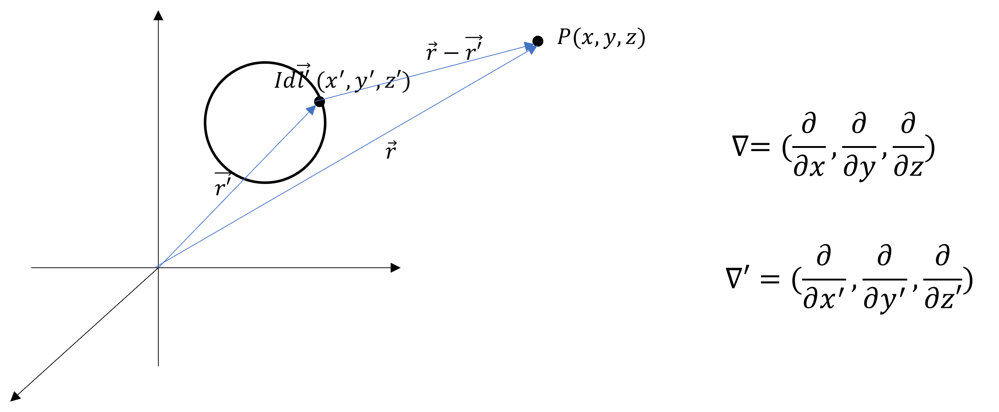

### 磁矢势的推导

磁矢势其引入方式与电势类似，但有点硬凑出来的感觉。

下面我们从电磁场的基本性质出发，系统推导磁矢势的数学表达式。

**与电势的类比**

对于稳恒电场，其基本性质由以下方程组描述：

$$
\begin{cases}
   \nabla \cdot \vec{E} = \rho / \varepsilon_0 \\\\
   \nabla \times \vec{E} = 0
\end{cases}
$$

电势的引入基于电场无旋性 $ \nabla \times \vec{E} = 0 $。由于任意标量函数的梯度的旋度恒为零 $ \nabla \times (\nabla U) = 0 $，我们可以定义电势 $ U $ 满足：

$$
\vec{E} = - \nabla U
$$

顺便提一下，$ \nabla \times (\nabla U) $ 类似于两个平行向量叉乘，围不成四边形，有向面积为 0。

**磁场的特殊性**

我们想按照电势的推导来推出类似磁势的东西，但却不能。

对于稳恒磁场，其基本性质为：

$$
\begin{cases}
   \nabla \cdot \vec{B} = 0 \\\\
   \nabla \times \vec{B} = \mu_0 \vec{j}
\end{cases}
$$

$$
\because \nabla \times \vec{B} \neq 0 \\\\
\therefore \vec{E} \neq - \nabla U_m
$$

与电场不同，磁场是有旋场 $ \nabla \times \vec{B} \neq 0 $，因此不能简单地定义标量磁势。

我们可以从磁场的无源性 $ \nabla \cdot \vec{B} = 0 $ 入手

$$
\because \nabla \cdot \vec{B} = 0, \nabla \cdot (\nabla \times \vec{A}) = 0 \\\\
\therefore \vec{B} = \nabla \times \vec{A}
$$

引入矢量函数 $ \vec{A} $ 满足 $ \nabla \cdot (\nabla \times \vec{A}) = 0 $。

顺便提一下，$ \nabla \cdot (\nabla \times \vec{A}) $ 类似于三个同一平面内的向量做混合积，围不成六面体，有向体积为 0。

### 磁矢势的具体表达式

为了得到 $ \vec{A} $ 的具体形式，我们从毕奥-萨伐尔定律出发进行推导。

**数学准备**

考虑图1所示的坐标系，定义：

* $\vec{r} = (x, y, z)$ ：场点位置矢量
* $\vec{r^{\prime}} = (x^{\prime}, y^{\prime}, z^{\prime})$ ：源点位置矢量
* $ R = |\vec{r} - \vec{r^{\prime}}| $
* $ d \vec{l^{\prime}} $ ：电流元方向

    

    
<strong>图 1</strong> 变量标识 

利用矢量恒等式：

$$
\nabla \times (\varphi \vec{C}) = \nabla \varphi \times \vec{C} + \varphi (\nabla \times \vec{C})
$$

令 $ \varphi = \frac{1}{R}， \vec{C} = d \vec{l^{\prime}} $，则有：

$$
\nabla \times (\frac{1}{R} d \vec{l^{\prime}}) = \nabla \frac{1}{R} \times d \vec{l^{\prime}} + \frac{1}{R} (\nabla \times d \vec{l^{\prime}})
$$

计算各项：

$$
\nabla = (\frac{\partial}{\partial x}, \frac{\partial}{\partial y}, \frac{\partial}{\partial z}) \\\\
\nabla (\frac{1}{R}) = \nabla (\frac{1}{|\vec{r} - \vec{r^{\prime}}|}) = - \frac{\vec{R}}{R^3} \\\\
\nabla \times d \vec{l^{\prime}} = \nabla \times (x^{\prime}, y^{\prime}, z^{\prime}) = 0
$$

因此：

$$
\begin{aligned}
\nabla \times (\frac{1}{R} d \vec{l^{\prime}})
&= - \frac{\vec{R}}{R^3} \times d \vec{l^{\prime}} + \frac{1}{R} (0) \\\\
&= \frac{d \vec{l^{\prime}} \times \vec{R}}{R^3}
\end{aligned}
$$

**与毕奥-萨伐尔定律的联系**

毕奥-萨伐尔定律给出：

$$
\vec{B} = \frac{\mu_0}{4 \pi} \oint_{L^{\prime}} \frac{I d \vec{l^{\prime}} \times \vec{R}}{R^3} = \frac{\mu_0 I}{4 \pi} \oint_{L^{\prime}} \frac{d \vec{l^{\prime}} \times \vec{R}}{R^3}
$$

将前面的结果代入：

$$
\begin{aligned}
\vec{B}
&= \frac{\mu_0 I}{4 \pi} \oint_{L^{\prime}} \nabla \times (\frac{1}{R} d \vec{l^{\prime}}) \\\\
&= \nabla \times (\frac{\mu_0 I}{4 \pi} \oint_{L^{\prime}} (\frac{1}{R} d \vec{l^{\prime}})) \qquad (\nabla \times \vec{a} + \nabla \times \vec{b} = \nabla \times (\vec{a} + \vec{b}))\\\\
&= \nabla \times (\frac{\mu_0}{4 \pi} \oint_{L^{\prime}} \frac{I d \vec{l^{\prime}}}{R})
\end{aligned}
$$

比较 $ \vec{B} = \nabla \times \vec{A} $，得到磁矢势的表达式：

$$
\vec{A} = \frac{\mu_0}{4 \pi} \oint_{L^{\prime}} \frac{I d \vec{l^{\prime}}}{R}
$$

### 磁矢势的物理意义

磁矢势虽然不像电势那样有直接的物理意义，但可以通过以下关系理解：

$$
\vec{B} = \nabla \times \vec{A} \\
\implies \iint \vec{B} \cdot d \vec{S} = \oint \vec{A} \cdot d \vec{l} \\
$$

$ \vec{A} $ 的物理意义（不像是物理意义）：在任意时刻，$ \vec{A} $ 沿任一闭合回路的线积分等于该时刻通过回路内的磁通量。

### 磁矢势的散度

磁矢势的旋度是磁感应强度，它的散度是：

$$
\nabla \cdot \vec{A} = \nabla \cdot (\frac{\mu_0}{4 \pi} \oint_{L^{\prime}} \frac{I d \vec{l^{\prime}}}{R}) = \frac{\mu_0 I}{4 \pi} \oint_{L^{\prime}} \nabla \cdot (\frac{d \vec{l^{\prime}}}{R}) \qquad (\nabla \cdot (\vec{a} + \vec{b}) = \nabla \cdot \vec{a} + \nabla \cdot \vec{b})
$$

由求导公式：

$$
\because \frac{1}{R} = \frac{1}{|\vec{r} - \vec{r^{\prime}}|} \\\\
\therefore \nabla (\frac{1}{R}) = - \nabla^{\prime} (\frac{1}{R})
$$

利用矢量恒等式：

$$
\begin{aligned}
\nabla \cdot (\varphi \vec{A}) &= \vec{A} \cdot \nabla \varphi + \varphi (\nabla \cdot \vec{A}) \\\\
\implies \nabla \cdot (\frac{d \vec{l^{\prime}}}{R}) &= d \vec{l^{\prime}} \cdot \nabla (\frac{1}{R}) + \frac{1}{R} (\nabla \cdot d \vec{l^{\prime}}) \\\\
&= d \vec{l^{\prime}} \cdot (- \nabla^{\prime} (\frac{1}{R})) + \frac{1}{R} (0) \\\\
&= - \nabla^{\prime} (\frac{1}{R}) \cdot d \vec{l^{\prime}}
\end{aligned}
$$

由斯托克斯定理：

$$
\begin{aligned}
\nabla \cdot \vec{A} &= \frac{\mu_0 I}{4 \pi} \oint_{L^{\prime}} \nabla \cdot (\frac{d \vec{l^{\prime}}}{R}) \\\\
&= \frac{\mu_0 I}{4 \pi} \oint_{L^{\prime}} - \nabla^{\prime} (\frac{1}{R}) \cdot d \vec{l^{\prime}} \\\\
&= - \frac{\mu_0 I}{4 \pi} \oint_{L^{\prime}} \nabla^{\prime} (\frac{1}{R}) \cdot d \vec{l^{\prime}} \\\\
&= - \frac{\mu_0 I}{4 \pi} \iint [\nabla^{\prime} \times \nabla^{\prime} (\frac{1}{R})] \cdot d \vec{S} = 0
\end{aligned}
$$

对面电流和体电流，该式均成立。

$$
\nabla \cdot \vec{A} \equiv 0
$$