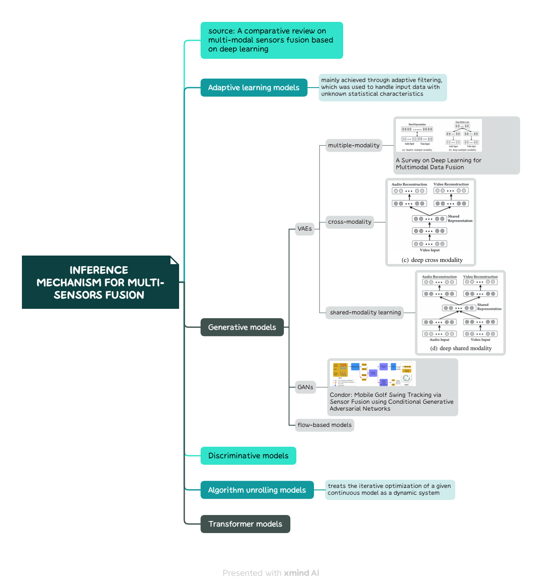

## Fusion stage

    

    
<strong>Figure 1:</strong> Mind map of Deep Multimodal Learning

## Inference mechanism for multi-sensors fusion

    

    
<strong>Figure 2:</strong> Mind map of A comparative review on multi-modal sensors fusion based on deep learning

