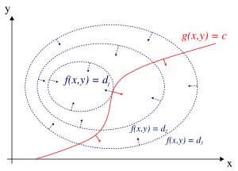
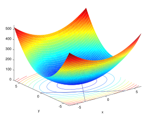

### Lagrangian relaxation

The explanation I provide is based on [Lagrangian relaxation-Wikipedia](https://en.wikipedia.org/wiki/Lagrangian_relaxation) and [Chapter 12 Lagrangian Relaxation-ens-lyon](https://www.ens-lyon.fr/DI/wp-content/uploads/2012/01/LagrangianRelax.pdf)

Lagrangian relaxation is a relaxation method which approximates a 
difficult problem of constrained optimization by a simpler problem.

The method penalizes violations of inequality constraints using a Lagrange 
multiplier, which imposes a cost on violations. These added costs are used 
instead of the strict inequality constraints in the optimization. In 
practice, this relaxed problem can often be solved more easily than the 
original problem.

**Mathematical description**

Suppose we are given a linear programming problem, with $ x \in R^n $ 
and $ A \in R^{m \times n} $, 
of the following form: 

$$
\begin{aligned}
\text{max} \quad & c^{\top} x \\\\
\text{s.t.} \quad & (1) A x \leq b
\end{aligned}
$$

We may introduce the constraint *(2)* into the objective:

$$
\begin{aligned}
\text{max} \quad & c^{\top} x + \lambda^{\top} (b - A x)
\end{aligned}
$$

If we let $ \lambda = (\lambda _{1},\ldots ,\lambda _{m_{2}}) $ be 
nonnegative weights, we get penalized if we violate the constraint *(1)*, 
and we are also rewarded if we satisfy the constraint strictly. The above 
system is called the Lagrangian relaxation of our original problem.

**The LR solution as a bound**

Of particular use is the property that for any fixed set of $ \vec{\lambda} \succeq \vec{0} $, values, the optimal result to the Lagrangian 
relaxation problem will be no smaller than the optimal result to the 
original problem. To see this, let $ \hat{x} $ be the optimal solution to 
the original problem, and let $ \bar{x} $ be the optimal solution to the 
Lagrangian relaxation. We can then see that 

$$
c^{\top} \hat{x} \leq c^{\top} \hat{x} + \vec{\lambda}^{\top} (b - A \hat
{x}) \leq c^{\top} \bar{x} + \vec{\lambda}^{\top} (b - A \bar{x})
$$

The first inequality is true because $ \hat {x} $ is feasible in the 
original problem and the second inequality is true because $ \bar {x} $ is 
the optimal solution to the Lagrangian relaxation.

**Iterating towards a solution of the original problem**

The above inequality tells us that if we minimize the maximum value we 
obtain from the relaxed problem, we obtain a tighter limit on the 
objective value of our original problem. Namely, if we find the minimum 
$ c^{\top} \bar{x} + \vec{\lambda}^{\top} (b - A \bar{x}) $, according to the above inequality, we have $ \hat{x} = \bar{x} $, and the optimal value for the original problem is found.
Thus we can address the original problem by instead exploring the 
partially dualized problem

$$
\text{min} \quad P(\lambda) \quad \text{s.t.} \quad \lambda \geq 0
$$

where we define $ P(\lambda) $ as 

$$
\begin{aligned}
\text{max} \quad & c^{\top} x + \lambda^{\top} (b - A x)
\end{aligned}
$$

A Lagrangian relaxation algorithm thus proceeds to explore the range of 
feasible $ \lambda $ values while seeking to minimize the result returned 
by the inner $ P $ problem. Each value returned by $ P $ is a candidate 
upper bound to the problem, the smallest of which is kept as the best 
upper bound.
If we additionally employ a **heuristic**, probably seeded by the 
$ \bar {x} $ 
values returned by $ P $, to find feasible solutions to the original 
problem, then we can iterate until the best upper bound and the cost of 
the best feasible solution converge to a desired tolerance.

**Gradient descent method**

0. Set $ k = 0 $ and choose $ \lambda_0 \in R^n $;
1. Compute $ P(\lambda_k) $ and a vector $ x_k \in X $ where it is achieved;
2. Calculate gradient $ g_k = A x_k − b $ of the function $ P $ at $ \lambda_k $;
3. If $ g_k = 0 $, then stop, the optimal solution is $ P(\lambda_k) $
4. Compute $ \lambda_{k+1} = \lambda_k +\theta^T_k g_k $ where $ \theta_k $ is the stepsize at this step.
5. Increment $ k $ and go to Step 2.

### Lagrange multiplier

The explanation I provide is based on [Lagrange multiplier-Wikipedia](https://en.wikipedia.org/wiki/Lagrange_multiplier) and [Lagrange multipliers intro | Constrained optimization (article)-Khan Academy](https://www.khanacademy.org/math/multivariable-calculus/applications-of-multivariable-derivatives/constrained-optimization/a/lagrange-multipliers-single-constraint)

In mathematical optimization, the method of Lagrange multipliers is a 
strategy for finding the local maxima and minima of a function subject to 
equation constraints. 

**Statement**

Let $ f: \mathbb{R}^n \to \mathbb{R} $ be the objective function, 
$ g: \mathbb{R}^n \to \mathbb{R}^c $ be the constraints function, 
both belonging to $ C^1 $ (i.e., having continuous first derivatives). 
Our optimization problem is:

$$
\begin{aligned}
\text{max} \quad & f(x) \\\\
\text{s.t.} \quad & g(x) = c,
\end{aligned}
$$

where $ c \in \mathbb{R}^c $.

**Method**

1. **Introduce the Lagrangian**

    Define a new function, the *Lagrangian*, by introducing a variable, 
    known as the *Lagrange multiplier*. The Lagrangian function is given 
    by:
    $$
    \mathcal{L}(\lambda, x) = f(x) + \lambda^{\top} (g(x) - c)
    $$

2. **Find Critical Points**

    Set the gradient of $ \mathcal{L} $ with respect to both $ \lambda $ 
    and $ x $ equal to the zero vector:
    $$
    \nabla {\mathcal{L}} (\lambda, x) = \vec{0}
    $$
    This yields the system of equations:
    $$
    \begin{aligned}
    \nabla_x \mathcal{L}(\lambda, x) &= \nabla f(x) + \nabla g(x)^{\top} \lambda = \vec{0}, \\\\
    \nabla_{\lambda} \mathcal{L}(\lambda, x) &= g(x) - c = \vec{0}.
    \end{aligned}
    $$

3. **Evaluate Solutions**

    Solve the system to find the critical points, denoted 
    $ (x_0, \lambda_0) $. Evaluate $ f(x) $ at each solution $ x_0 $.
    The solution corresponding to the highest value of $ f(x) $ is the 
    maximum, and the one corresponding to the lowest value is the minimum 
    (if required).

**Single constraint**

    

    
<strong>Figure 1:</strong> The red curve shows the constraint $ g(x, y) = c $. The blue curves are contours of $ f(x, y) $. The point where the red constraint tangentially touches a blue contour is the maximum of $ f(x, y) $ along the constraint, since $ d1 > d2 $.

 

For the case of only one constraint and only two choice variables (as 
exemplified in Figure 1), consider the optimization problem

$$
\begin{aligned}
\underset{x,y}{\text{maximize}} \quad& f(x,y) \\
\text{subject to}\quad& g(x,y) = c.
\end{aligned}
$$

We assume that both $ f $ and $ g $ have continuous first partial 
derivatives.

The method of Lagrange multipliers relies on the intuition that at a 
maximum, $ f(x, y) $ cannot be increasing in the direction of any such 
neighboring point that also has $ g(x, y) = 0 $. If it were, we could walk 
along $ g = 0 $ to get higher, meaning that the starting point wasn't 
actually the maximum. Viewed in this way, it is an exact analogue to 
testing if the derivative of an unconstrained function is $ 0 $, that is, 
we are verifying that the directional derivative is 0 in any relevant 
(viable) direction.

We can visualize contours of $ f $ given by $ f(x, y) = d $ for various 
values of $ d $, and the contour of $ g $ given by $ g(x, y) = c $.

Suppose we walk along the contour line with $ g = c $. We are interested 
in finding points where $ f $ almost does not change as we walk, since 
these points might be maxima.

There are two ways this could happen:

1. We could touch a contour line of $ f $ (**walk along the contour line with $ g = c $ and a contour line of $ f $ simultaneously**), since by definition $ f $ does 
not change as we walk along its contour lines. This would mean that the 
tangents to the contour lines of $ f $ and $ g $ are parallel here.
2. We have reached a "level" part of $ f $, meaning that $ f $ does not 
change in any direction.

To check the first possibility (we touch a contour line of $ f $), notice 
that since the gradient of a function is perpendicular to the contour 
lines, the tangents to the contour lines of $ f $ and $ g $ are parallel 
if and only if **the gradients of $ f $ and $ g $ are parallel**. Thus we want 
points  $ (x, y) $ where $ g(x, y) = c $ and

$$
\nabla_{x,y} f = \lambda \nabla_{x,y} g,
$$

for some $ \lambda $

where

$$
\nabla_{x,y} f = \left( \frac{\partial f}{\partial x}, \frac{\partial f}{\partial y} \right), \qquad \nabla_{x,y} g = \left( \frac{\partial g}{\partial x}, \frac{\partial g}{\partial y} \right)
$$

are the respective gradients. The constant $ \lambda $ is required because 
although the two gradient vectors are parallel, the magnitudes of the 
gradient vectors are generally not equal. This constant is called the 
Lagrange multiplier. (In some conventions $ \lambda $ is preceded by a 
minus sign).

Notice that this method also solves the second possibility, that $ f $ is 
level: if $ f $ is level, then its gradient is zero, and setting 
$ \lambda = 0 $ is a solution regardless of $ \nabla_{x,y} g $.

To incorporate these conditions into one equation, we introduce an 
auxiliary function

$$ \mathcal{L}(x,y,\lambda) \equiv f(x,y) + \lambda \cdot g(x,y)\, ,$$

and solve

$$ \nabla_{x,y,\lambda} \mathcal{L}(x, y, \lambda) = 0 ~.$$

Note that this amounts to solving three equations in three unknowns. This 
is the method of Lagrange multipliers.

Note that $ \nabla_{\lambda} \mathcal{L}(x, y, \lambda) = 0  $ implies $ g(x,y) = 0 $, as the partial derivative of $ \mathcal{L} $ with respect to $ \lambda $ is $ g(x,y) ~. $

To summarize

$$
\nabla_{x,y,\lambda} \mathcal{L}(x, y, \lambda) = 0 \iff 
\begin{cases}
\nabla_{x,y} f(x , y) = -\lambda \, \nabla_{x,y} g(x , y) \\\\
g(x,y) = 0
\end{cases}
$$

The method generalizes readily to functions on $ n $ variables

$$
\nabla_{x_1, \dots, x_n,\lambda} \mathcal{L}(x_1, \dots, x_n, \lambda) = 0
$$

which amounts to solving $ n + 1 $ equations in $ n + 1 $ unknowns.

The constrained extrema of $ f $ are critical point of the Lagrangian 
$ \mathcal{L} $, but they are not necessarily local extrema of $ \mathcal{L} $.

**Multiple constraints**

    

    
<strong>Figure 2:</strong> A paraboloid constrained along two intersecting lines.

    

    
<strong>Figure 3:</strong> Contour map of Figure 2.

 

The method of Lagrange multipliers can be extended to solve problems with 
multiple constraints using a similar argument. Consider a paraboloid 
subject to two line constraints that intersect at a single point. As the 
only feasible solution, this point is obviously a constrained extremum. 
However, the level set of $ f $ is clearly not parallel to either 
constraint at the intersection point (see Figure 3); instead, it is a 
linear combination of the two constraints' gradients. In the case of 
multiple constraints, that will be what we seek in general: The method of 
Lagrange seeks points not at which the gradient of $ f $ is a multiple of 
any single constraint's gradient necessarily, but in which it is a linear 
combination of all the constraints' gradients.

Concretely, suppose we have $ M $ constraints and are walking along the 
set of points satisfying $ g_i(\mathbf{x}) = 0, i=1, \dots, M \,.$ Every 
point $ \mathbf{x} $ on the contour of a given constraint function $g_i$ 
has a space of allowable directions: the space of vectors perpendicular to 
$ \nabla g_i(\mathbf{x}) \, .$ The set of directions that are allowed by 
all constraints is thus the space of directions perpendicular to all of 
the constraints' gradients. Denote this space of allowable moves by $\ A\ 
$ and denote the span of the constraints' gradients by $ S \,.$ Then $ A = 
S^{\perp}\, ,$ the space of vectors perpendicular to every element of $ S 
\,.$

We are still interested in **finding points where $ f $ does not change as 
we walk, since these points might be (constrained) extrema**. We therefore 
seek $ \mathbf{x} $ such that any allowable direction of movement away 
from $\mathbf{x}$ is perpendicular to $ \nabla f(\mathbf{x}) $ (otherwise 
we could increase $f$ by moving along that allowable direction). In other 
words, $ \nabla f(\mathbf{x}) \in A^{\perp} = S \,.$ Thus there are 
scalars $ \lambda_1, \lambda_2,\ \dots, \lambda_M $ such that

$$
\nabla f(\mathbf{x}) = \sum_{k=1}^M  \lambda_k \, \nabla g_k (\mathbf{x})  \quad \iff \quad \nabla f(\mathbf{x}) - \sum_{k=1}^M {\lambda_k \nabla g_k (\mathbf{x})} = 0 ~.
$$

These scalars are the Lagrange multipliers. We now have $ M $ of them, one 
for every constraint.

As before, we introduce an auxiliary function

$$
\mathcal{L} (x_1, \ldots, x_n, \lambda_1, \ldots, \lambda_M) = f (x_1, \ldots, x_n) - \sum\limits_{k=1}^M {\lambda_k g_k ( x_1, \ldots , x_n )}
$$

and solve

$$
\nabla_{x_1, \ldots , x_n, \lambda_1, \ldots, \lambda_M} \mathcal{L} (x_1, \ldots, x_n, \lambda_1, \ldots, \lambda_M) = 0 \iff 
\begin{cases}
\nabla f(\mathbf{x}) - \sum_{k=1}^M {\lambda_k \, \nabla g_k (\mathbf{x})} = 0 \\\\
 g_1(\mathbf{x}) = \cdots = g_M(\mathbf{x}) = 0
\end{cases}
$$

which amounts to solving $ n+M $ equations in $ n+M $ unknowns.

The constraint qualification assumption when there are multiple 
constraints is that the constraint gradients at the relevant point are 
linearly independent.