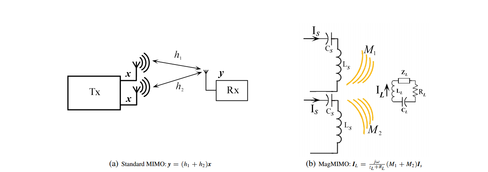

## Magnetic MIMO: how to charge your phone in your pocket

### Motivation

1. **Current wireless chargers** need to remember to regularly charge our mobile phones which **is not the wireless charging we hoped for**. We would like to have our cell phones charged in our pockets, and never again worry about forgetting to charge the phone.
2. MIMO RF techniques power phones remotely, however, delivering a large amount of power via radiation can cause local heating inside the human body.

### Contribution

1. They propose a novel design that focuses the magnetic flux from multiple coils in a steerable beam and points it at the phone, in a manner analogous to multi-antenna beamforming in wireless communications. 
2. The design can charge unmodified smart phones **at distances up to 40 cm, and works regardless of the phone orientation** with respect to the charging pad.

### Magnetic-Beamforming

    

    
<strong>Figure 1:</strong> Illustration of the analogies between standard MIMO and MagMIMO.

 

For a 2-antenna MIMO transmitter.

The receiver current $I_L$ is analogous to the received signal y in a MIMO 
communication system.

Thus, similar to traditional MIMO beamforming, we can maximize the current induced 
in the receiver's coil, $I_L$, by scaling the current flowing in the transmitter's 
coils $I_S$ with a magnetic-beamforming vector.

### Derivation of beamforming vector

The derivation process refers to the article [Maximum Ratio Combining (MRC)](https://wirelesspi.com/maximum-ratio-combining-mrc/)

#### Setup

Consider a wireless link with 2 Tx antennas and 1 Rx antenna. The expressions for the 
signals at the Rx is given by

$$ r_1 = h_1 \cdot s + noise $$

$$ r_2 = h_2 \cdot s + noise $$

s is a symbol of data transmitted, h is the flat fading channel gain between the Tx antenna and the first receive antenna, which is usually modeled as complex Gaussian random variables.

#### Intuitive thoughts

**selection combining:** simply scan the power arriving at each antenna and choose the one with the highest SNR. However, selecting the antenna with the best SNR implies that energy at the other antennas is neglected.

**simple summation:** sum the signal from all these antennas. Recall that the channel gains $h_1$ and $h_2$ are complex Gaussian random variables here. This in turn implies that their magnitudes are Rayleigh distributed and phases are uniformly distributed between 0 and 2π. Therefore, adding several complex numbers with random phases tends to average out the summation!

**maximum ratio combining:** weighted sum of the signal from all these antennas.

#### Computing the Weights $w_i$

A Maximum Ratio Combining (MRC) receiver is formed through a linear combination of $r_1$ and $r_2$ after weighting them with complex scalars $w_1$ and $w_2$, respectively. The output signal $ z $ is given by

$$ z = w_1 \cdot r_1 + w_2 \cdot r_2 + noise $$

$$ z = w_1 \cdot h_1 \cdot s + w_2 \cdot  h_2 \cdot s + noise $$

$$ z = s \cdot \{ w_1 \cdot h_1 + w_2 \cdot h_2 \} + noise $$

The general expression for $N_R$ antennas can be written as

$$
\tag{1}
z = s \sum_{j=1}^{N_R} w_j \cdot h_j + noise
$$

Each channel gain $ h_j $ is a complex number with magnitude 
$ |h_j| $ and phase $ ∡h_j $. Magnitudes and phases of 
$ w_j $ can be represented in a similar manner. Then, we can 
write their complex product (in which magnitudes are multiplied 
while phases are added) below. In complex notation, this is 
written as

$$
\tag{2}
w_j \cdot h_j = |w_j| \cdot |h_j| \cdot e^{j(∡w_j + ∡h_j)}
$$

#### Canceling the Phase

If the weight $w_j$ has an opposite phase as compared to that of $h_j$, we have $∡w_j = −∡h_j$ and the complex multiplication will cancel out the phases, see equation *(2)*. On the other hand, noise samples simply add without any phase alignment. With this substitution, the combiner output from equation *(1)* becomes

$$
\tag{3}
z = s \sum_{j=1}^{N_R} |w_j| \cdot |h_j| + noise
$$

where the effect of scaling by $w_j$ on the noise samples is ignored here. This phase cancellation is shown on the left of the figure below. **All channel gains are said to be aligned at the Rx in the same direction (all are 0° angle).** Since we have not yet modified the magnitude of 
$w_j$, all 
$w_j$ have unit magnitude here. This scheme is known as Equal Gain Combining (EGC).

#### Grading the Magnitude

It is obvious that the branches with better SNR provide a more reliable contribution towards making the modulation symbol decision. Therefore, **the branches with higher SNRs should be given more weight as compared to the ones with less signal energy.** In the algorithm, this can be accomplished by choosing 
$|w_j|$ the same as 
$ \frac{|h_j|}{\sqrt{\sum_{j=1}^{N_R} |h_j|^2}} $ 
which is a **measure of confidence** for the channel gain at i-th Rx antenna.

In summary, since the conjugate of a complex number inverts its phase but leaves the magnitude unchanged, the optimal 
$w_j$ can be chosen as complex conjugates of 
$h_j$, normalized by 
$\sqrt{\sum_{j=1}^{N_R} |h_j|^2}$. $w_j = \frac{h_j^*}{\sqrt{\sum_{j=1}^{N_R} |h_j|^2}}$
When the magnitudes of $w_j$ are chosen according to the above expression, equation *(3)* becomes

$$
z = s \frac{1}{\sqrt{\sum_{j=1}^{N_R} |h_j|^2}} \sum_{j=1}^{N_R} |h_j|^2 + noise
$$

 

Like vote of country's ideology, everyone should vote in such decisions and every vote should be weighted (on a scale from 0 to 1) in proportion to the person's expertise in the relevant matter.

 

## Wireless Power Hotspot that Charges All of Your Devices

### Motivation

1. Academic research has taken important steps towards wirelessly 
delivering power to multiple receivers using magnetic coupling. They 
assume the receiver coil is aligned with the transmitter coil,
and **do not deal with different receiver orientations with respect 
to the transmitter**. However, the user cannot benefit from an
increase in charging distance if she has to hold her device on top 
of the charging pad and maintain a perfect alignment with the 
charger.

2. While **MagMIMO** could wirelessly charge our device  up to 40 cm 
and in flexible orientations, it remains **limited to a single 
device at a time**.

3. While **one work demonstrates the potential of multi-user charging**, 
it presents an optimal solution only for a single receiver, and 
**uses brute force exploration to determine the optimal solution 
for two receivers.**

### Contribution

1. MultiSpot formulates the **multi-receiver magnetic charging 
problem** and derives a solution whose equations account for 
inter-receiver interactions.

2. MultiSpot's magnetic coupling can charge mobile phones and 
wearables up to **50 cm and in flexible orientations**.

### Multi-Coil System

    

    
<strong>Figure 2:</strong> Circuit Schematic and Denotations of a Multi-Coil Tx, Multiple Rx Wireless Power Delivery System.

 

Receiver u's circuit equation:

$$
\tag{4}
I_{R_u} Z_{R_u} + \sum_{v \neq u} jw M_{R_{uv}} I_{R_v} = \sum_i jw M_{iu} I_{T_i}
$$

Because $M$ is Tx-Rx magnetic couplings, for
$ \sum_i jw M_{iu} I_{T_i} $, 
M's i is leading u.

The transmitter voltage at coil i is:

$$
\tag{5}
V_{T_i} = Z_{T_i} I_{T_i} + \sum_{k \neq i} jw M_{T_{ik}} I_{T_k} - \sum_u jw M_{iu} I_{R_u}
$$

For convenience, we rewrite equation *(4)* and equation *(5)* in matrix form:

Rx Equation:

$$ Z_R \vec{i_R} = jw M \vec{i_T} $$

$$
\tag{6}
\vec{i_R} = jw Z_R^{-1} M \vec{i_T}
$$

Tx Equation:

$$ \vec{v_T} = Z_T \vec{i_T} - jw M^{\top} \vec{i_R} $$

substituting $\vec{i_R}$ using  equation *(6)*.

$$ \vec{v_T} = Z_T \vec{i_T} + w^2 M^{\top} Z_R^{-1} M \vec{i_T} $$

$$
\tag{7}
\vec{v_T} = (Z_T + w^2 M^{\top} Z_R^{-1} M) \vec{i_T}
$$

### Prove of $ \Delta \vec{v_T} $ differs between the algorithm and the appendix

in algorithm,

$$
\Delta \vec{v_T} = (Z_T + \tilde{Y}) \Delta \vec{i_T}
$$

Because

$$ \Delta \vec{i_T} = \vec{i_T^{bf}} - \vec{i_T} $$

So

$$ \Delta \vec{v_T} = (Z_T + \tilde{Y}) (\vec{i_T^{bf}} - \vec{i_T}) $$

in algorithm

$$ \vec{v_T^{bf}} = (Z_T + \tilde{Y}) \vec{i_T^{bf}} $$

because had applied $ \vec{v_T^{bf}} $ in the circuits, in fact, also,

$$ \vec{v_T^{bf}} = (Z_T + Y) \vec{i_T} $$

using above two equtions, 

$$ \Delta \vec{v_T} = \vec{v_T^{bf}} - (Z_T + \tilde{Y}) \vec{i_T} $$

$$ \Delta \vec{v_T} = (Z_T + Y) \vec{i_T} - (Z_T + \tilde{Y}) \vec{i_T} $$

$$ \Delta \vec{v_T} = (Y - \tilde{Y}) \vec{i_T} $$

Which is identical to the expression of $ \Delta \vec{v_T} $ in appendix C.

### Understanding of Proof of Theorem 4.3

$$
rank(Y - \tilde{Y} - \frac{\Delta \vec{v_T}\Delta \vec{v_T^{\top}}}{\Delta \vec{v_T^{\top}} \vec{i_T}})
\leq rank(Y - \tilde{Y}) - 1
$$

$$ rank(Y - \tilde{Y} - \frac{\Delta \vec{v_T}\Delta \vec{v_T^{\top}}}{\Delta \vec{v_T^{\top}} \vec{i_T}} - \frac{\Delta \vec{v_T}\Delta \vec{v_T^{\top}}}{\Delta \vec{v_T^{\top}} \vec{i_T}})
\leq rank(Y - \tilde{Y} - \frac{\Delta \vec{v_T}\Delta \vec{v_T^{\top}}}{\Delta \vec{v_T^{\top}} \vec{i_T}}) - 1
\leq rank(Y - \tilde{Y}) - 1 - 1
$$

$$ \cdots $$

When $ rank(Y - \tilde{Y}) = 0 $, 
$ Y - \tilde{Y} = O $,
$ Y = \tilde{Y} $.