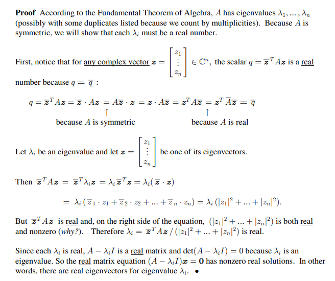

## Determinant of Matrix Product

### Theorem

Let $ A, B $ be a square matrices of order n.

Let $ det(A) $ be the determinant of $ A $.

Let $ AB $ be the matrix product of 
$ A $ and 
$ B $.

Then:

$ det(AB) = det(A)det(B) $

### Proof

Consider two cases:

1. $ A $ is singular.

2. $ A $ is nonsingular.

**proof of case1**

Assume $ A $ is singular.

Then:

$$ det(A) = 0 $$

**Also if A is singular then so is AB.**

Indeed, if $ AB $ has an inverse $ C $, then:

$$ ABC = E $$

whereby $ BC $ is a right inverse of $ A $.

It follows by Left or Right Inverse of Matrix is Inverse that in that case $ BC $ is the inverse of $ A $. This contradicts the assumption.

It follows that:

$$ det(AB)=0 $$

Thus:

$$ 0 = 0 \times det(B) $$

that is:

$$ det(AB) = 0 = det(A)det(B) $$

**proof of case2**

Assume $ A $ is nonsingular.

Then $ A $ is a product of elementary row matrices,  $E $.

Let $ A=E_kE_{k−1}⋯E_1 $.

So:

$$ det(AB) = det(E_kE_{k−1}⋯E_1B) $$

It remains to be shown that for any square matrix $ D $ of order n:

$$ det(ED) = det(E) det(D) $$

$ det(ED) = -|D| = det(E) det(D) $ for swap 2 rows

$ det(ED) = k|D| = det(E) det(D) $ for apply k to 1 row

$ det(ED) = |D| = det(E) det(D) $ for row(i) + k x row(j)

Then:

$ det(AB) = det(E_kE_{k−1}⋯E_1B) $

$ det(AB) = det(E_k) det(E_{k−1}⋯E_1(B)) $

$ det(AB) = αdet(B) $

and:

$ det(A) = det(E_kE_{k−1}⋯E_1I) $

$ = det(E_kE_{k−1}⋯E_1(I)) $

$ = αdet(I) $

Therefore:

$ det(AB)=det(A)det(B) $

## Real Symmetric Matrix

### Theorem

If $ A $ is a (real) $ n \times n $ symmetric matrix, then $ A $ has n real eigenvalues (counted bytheir multiplicities). For each eigenvalue, we can find a real eigenvector associated with it.

### Proof

### Theorem

A real symmetric matrix must be orthogonally diagonalizable.

### Proof 

This is a proof by induction, and it uses some simple facts about partitioned matrices and change of coordinates.

This is obviously true for every $ 1 \times 1 $ matrix $ A $ if $ A = [a] $, then 
$ E_1^{-1} (a) E_1 = (a) $

Assume now that every $ (n - 1) \times (n - 1) $ real symmetric matrix is orthogonally diagonalizable.

Consider an $ n \times n $ real symmetric matrix $ A $ where $ n \gt 1 $. By the preceding theorem, we can find a real eigenvalue $ \lambda $ of $ A $, together with a real eigenvector $ v_1 $. By normalizing, we can assume 
$ v_1 $ is a unit eigenvector. Add vectors to extend 
$ (v_1) $ to a basis for 
$ R^n $ and then use the Gram Schmidt process to get an orthonormal basis for 
$ R^n $: 
$ (v_1, v_2, ..., v_n) $. 

Let

$ T_1 = (v_1, v_2, ..., v_n) $.

$ T_1 $ is orthogonal.

Now look that

$$ T_1^{-1} A T_1 = T_1^{-1} (A v_1, A v_2, ..., A v_n) $$

$$ T_1^{-1} A T_1 = (T_1^{-1} \lambda_1 v_1, T_1^{-1} A v_2, ..., T_1^{-1} A v_n) $$

Because $ T_1^{-1} T_1 = E $, we have

$$ T_1^{-1} (v_1, v_2, ..., v_n) = (\epsilon_1, \epsilon_2, ..., \epsilon_n) $$

Thus, $ T_1^{-1} v_1 = \epsilon_1 $, So column 1 of
$ T_1^{-1} A T_1 $ is 
$ \lambda_1 \epsilon_1 $. Suppose now that

$$
T_1^{-1} A T_1 = 
\begin{pmatrix}
   \lambda_1 & \alpha \\\\
   \mathbf{0} & \beta
\end{pmatrix}
$$

$ T_1^{-1} A T_1 $ is symmetric, because

$$
(T_1^{-1} A T_1)^{\top} = (T_1^{\top} A T_1)^{\top} = 
T_1^{\top} A^{\top} T_1^{\top \top} = T_1^{\top} A T_1 = 
T_1^{-1} A T_1
$$

So $ \alpha = \mathbf{0} $, and 
$ \beta $ is a real symmetric matrix. By the induction hypothesis, $ \beta $ is diagonalizable. Thus, 
we has $ T_2 $ such that

$$
T_2^{-1} \beta T_2 = diag\\{\lambda_2, \lambda_3, ..., \lambda_n\\}
$$

Let 

$$
T = T_1 
\begin{pmatrix}
   1 & \mathbf{0} \\\\
   \mathbf{0} & T_2
\end{pmatrix}
$$

$$
T^{-1} A T = 
\begin{pmatrix}
   1 & \mathbf{0} \\\\
   \mathbf{0} & T_2
\end{pmatrix}^{-1}
T_1^{-1} A T_1 
\begin{pmatrix}
   1 & \mathbf{0} \\\\
   \mathbf{0} & T_2
\end{pmatrix}
$$

$$
T^{-1} A T = 
\begin{pmatrix}
   1 & \mathbf{0} \\\\
   \mathbf{0} & T_2^{-1}
\end{pmatrix}
\begin{pmatrix}
   \lambda_1 & \mathbf{0} \\\\
   \mathbf{0} & \beta
\end{pmatrix}
\begin{pmatrix}
   1 & \mathbf{0} \\\\
   \mathbf{0} & T_2
\end{pmatrix}
$$

$$
T^{-1} A T = 
\begin{pmatrix}
   \lambda_1 & \mathbf{0} \\\\
   \mathbf{0} & T_2^{-1} \beta T_2
\end{pmatrix}
$$

$$
T^{-1} A T = diag\\{\lambda_1, \lambda_2, ..., \lambda_n\\}
$$

Therefore, a real symmetric matrix must be orthogonally diagonalizable.