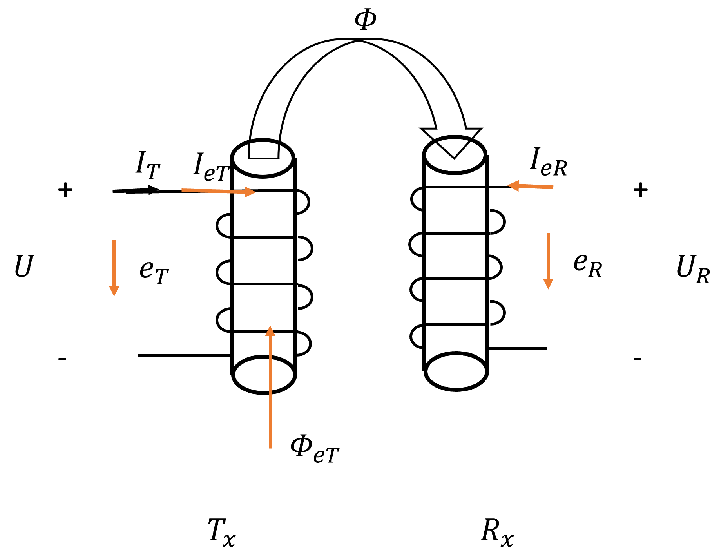
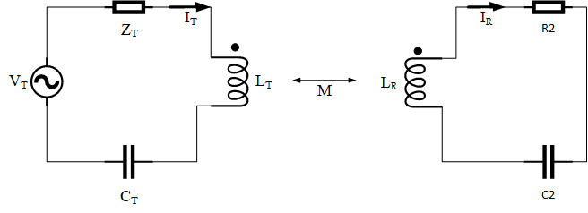
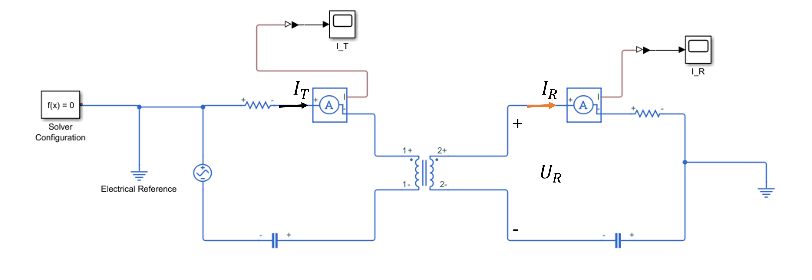
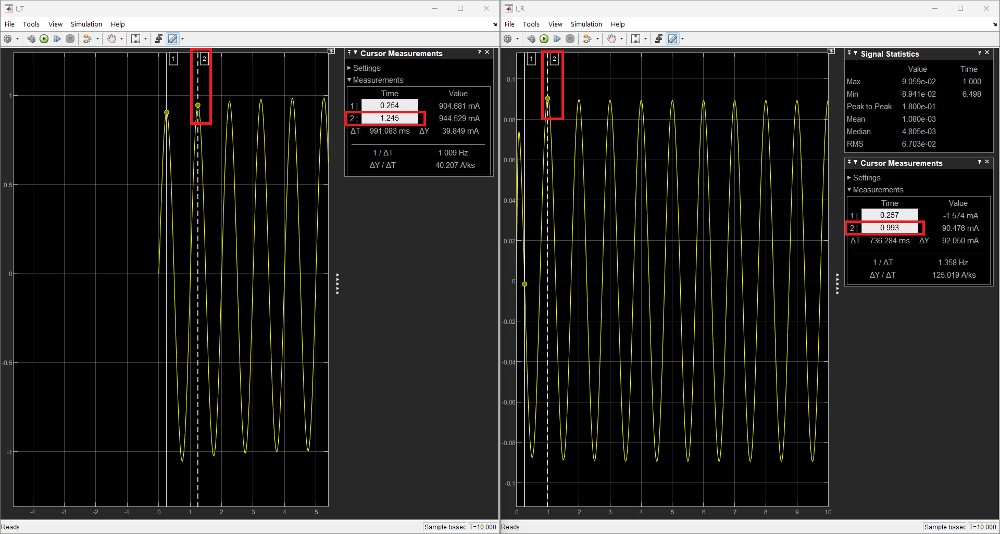

### 一、结论速览

✅ 关键结论：Tx 端电流从同名端流入时，Rx 端电流从同名端流出，互感值的正负取决于 Rx 端电压和 Rx 端电流的参考方向关系：

* 关联参考方向时：$ M < 0 $
* 非关联参考方向时：$ M > 0 $

### 二、理论分析

我们首先来看一个简单的互感线圈模型，其中电压 $ U_R $ 和电流 $ I_R $ 取非关联参考方向，且同名端对齐：

    

    
<strong>图 1:</strong> 互感线圈结构示意图 

 

假设通过线圈的电流为 $ I = I_m sin(\omega t) $，我们重点分析前半个周期。

**1.第一个 1/4 周期分析（$ t = 0 \to \frac{\pi}{2} $）**

在这个时间段内：

1. 电流为正且在增加（$ \frac{dI}{dt} > 0 $）

2. 根据右手定则，磁通量方向如图 1 所示，并且在增大

3. 因为感应电动势的方向总是企图由它产生的感应电流建立一个附加磁通量，以阻碍引起感应电动势的那个磁通量的变化。可以知道感应电流 $ I_{eT} $ 产生向下的磁通量，感应电流 $ I_{eR} $ 产生向上的磁通量

对应的感应电动势 $ e_T, e_R $，感应电流 $ I_{eT}, I_{eR} $ 和 方向如图 2 所示：

    

    
<strong>图 2:</strong> 在 $ t = 0 \to \frac{\pi}{2} $ 时的感应电动势和感应电流 

 

1. 感应电压 $ U_R $ 是外电路测量值，满足：$ U_R > 0 $
2. 根据感应电压公式 $ U = -e_R = M \frac{d I_T}{dt} $
3. 此时 $ \frac{d I_T}{dt} > 0 $，故 $ M > 0 $

**2.第二个 1/4 周期分析（$ t = \frac{\pi}{2} \to \pi $）**

在这个时间段内：

1. 电流正向减小（$ \frac{dI}{dt} < 0 $）
2. 根据右手定则，磁通量方向如图 1 所示，并且在减小
3. 感应电流 $ I_{eT} $ 产生向上的磁通量，感应电流 $ I_{eR} $ 产生向下的磁通量

感应电流和电动势方向如图 3 所示：

1. 感应电压 $ U_R < 0 $
2. 根据感应电压公式 $ U_R = -e_R = M \frac{dI}{dt} $
3. 此时 $ \frac{dI}{dt} < 0 $，仍得 $ M > 0 $

    

    
<strong>图 3:</strong> 在 $ t = \frac{\pi}{2} \to \pi $ 时的感应电动势和感应电流 

 

同名端的定义：具有磁耦合关系的两个线圈，当任何一个线圈中通过的电流发生变化时，在两线圈上引起的感应电动势的极性始终保持一致的端子称为同名端。

可以看到上面的分析中，$ e_T $ 和 $ e_R $ 的方向始终保持一致。 

用这种方法分析 $ U $ 和 $ I $ 取关联方向时，互感值取负号。线圈换另外一个方向得到的结论也是相同的。在此就不做展开了，有兴趣的读者可以自行尝试。

### 三、MATLAB Simscape 仿真验证

为了直观验证理论分析，我使用 MATLAB Simscape 搭建了 1Tx-1Rx 电路仿真模型。

理论电路图如图 4 所示：

    

    
<strong>图 4:</strong> 1Rx-1Tx 电路结构示意图 

 

**仿真电路参数**

* 交流电压源：幅值 $ 10 V $，频率 $ 1 Hz $
* 电阻 $ 10 \Omega $
* 电感 $ 0.159155 H $
* 电容 $ 0.159155 F $

**非关联参考方向分析**

仿真电路图如图 5 所示:

    

    
<strong>图 5:</strong> 1Rx-1Tx 仿真电路图（电压电流取非关联参考方向） 

 

**关键波形测量**

* 电流传感器测量 Tx 回路电流 $ I_T $
* 电流传感器测量 Rx 回路电流 $ I_R $

对于这个电路（我们假设 Tx 和 Rx 电路处于谐振状态），我们列电路方程如下：

$$
Rx: I_R Z_R = U_R = j \omega M I_T
$$

    

    
<strong>图 6:</strong> 电压电流取非关联参考方向时，Tx 电路电流（左）与 Rx 电路电流（右）波形 

**相位关系分析**

从仿真波形可以清晰观察到：
1. 相位差：$ I_T $ 滞后 $ I_R $ $ 0.005 s $
2. 频域关系：$ I_R Z_R = U_R = j \omega M I_T $

✅ 验证结果：只有当 $ M > 0 $ 时，$ I_T $ 才会滞后 $ I_R $ $ 90 \degree $，这与我们的理论分析完全一致。

**关联参考方向分析**

仿真电路图如图 7 所示:

    

    
<strong>图 7:</strong> 1Rx-1Tx 仿真电路图（电压电流取关联参考方向） 

对于这个电路（我们假设 Tx 和 Rx 电路处于谐振状态），我们列电路方程如下：

$$
Rx: I_R Z_R + U_R = 0 \\
\implies I_R Z_R = -U_R = -j \omega M I_T
$$

从上面的仿真波形可以清晰观察到：
1. 相位差：$ I_T $ 滞后 $ I_R $ $ 0.005 s $
2. 频域关系：$ I_R Z_R = -U_R = -j \omega M I_T $

✅ 验证结果：只有当 $ M < 0 $ 时，$ I_T $ 才会滞后 $ I_R $ $ 90 \degree $。